# Revive High-Level Design (HLD)

## 1. Overview

**Revive** is an AI-powered revenue recovery agent for B2B SaaS.

The initial use case is **non-renewal recovery**:

> Investigate why a valuable customer did not renew, determine whether recovery is rational, recommend the right intervention, execute controlled actions, and verify the result.

Revive is API-first and exposes two client interfaces:

1. Web UI for human users
2. MCP server for AI clients such as ChatGPT, Claude, Cursor, and other MCP-compatible clients

The core agent is built with LangGraph. FastAPI is the application boundary and FastMCP exposes Revive as an MCP server.

---

## 2. Architecture Principles

- **FastAPI is the application boundary**
- **FastMCP is the external AI/MCP boundary**
- **LangGraph is the workflow orchestration layer**
- **Domain services contain business logic**
- **MCP is used for upstream integrations**
- **Evidence is a first-class object**
- **LLMs reason over structured evidence instead of raw vendor APIs**
- **Financial and external actions require policy checks**
- **Every important action has a verification step**
- **REST and MCP interfaces use the same application services**

---

## 3. System Architecture

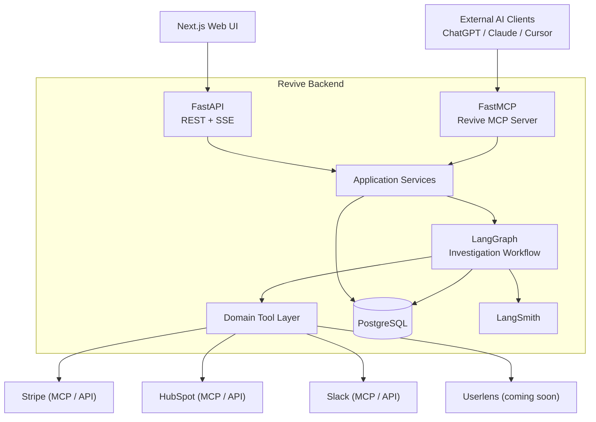

---

## 4. Client Interfaces

### Web UI

The web application is the primary visual interface for the hackathon demo.

It provides:

- Start investigation
- Investigation progress
- Evidence timeline
- Cause analysis
- Recoverability decision
- Recommended intervention
- Pending approvals
- Action execution
- Verification results
- Audit trail

### Revive MCP

Revive is also exposed as an MCP server.

Example:

```text
User in Claude:

"Investigate why Acme Corp did not renew."

        ↓

Claude calls:

revive.investigate_customer({
    customer: "Acme Corp"
})

        ↓

Revive runs its LangGraph workflow.

        ↓

Structured investigation result
```

This allows Revive to be used as a capability inside another AI agent.

---

## 5. FastAPI and FastMCP

FastAPI owns the HTTP application.

Example API surface:

```text
GET  /api/v1/health
POST /api/v1/investigations
GET  /api/v1/investigations
GET  /api/v1/investigations/{id}
GET  /api/v1/investigations/stream                 (SSE: start + stream)
GET  /api/v1/investigations/{id}/resume-stream     (SSE: resume + stream)
POST /api/v1/investigations/{id}/resume

GET  /api/v1/approvals
POST /api/v1/approvals/{id}/approve
POST /api/v1/approvals/{id}/reject

GET  /api/v1/customers                              (book of business: lost / at-risk renewals)
GET  /api/v1/connections
POST /api/v1/connections
DELETE /api/v1/connections/{provider}
```

FastMCP is mounted into the same ASGI application.

```text
https://api.revive.ai/
├── /api/v1/*
└── /mcp
```

The MCP server does not duplicate business logic.

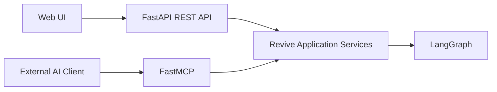

Both interfaces eventually call the same application services.

---

## 6. Public Revive MCP Tools

Keep the public MCP surface small and business-oriented. The implemented tools are:

```text
investigate_customer(customer)
get_investigation_result(investigation_id)
list_recent_investigations()
resume_recovery(investigation_id, approved, edits?)
```

`investigate_customer` runs the full workflow and returns the structured result (including a
`pending_action` and `waiting_for_approval` status when a customer-facing action needs sign-off);
`resume_recovery` approves or rejects that pending action. All four call the same application
services as the REST API.

Do not expose vendor-specific tools such as `stripe_api_read` or `search_slack` through the public Revive MCP.

The external client should interact with Revive's business capabilities, not its internal implementation.

---

## 7. Upstream MCP Architecture

Revive consumes official MCP servers from its integrations.

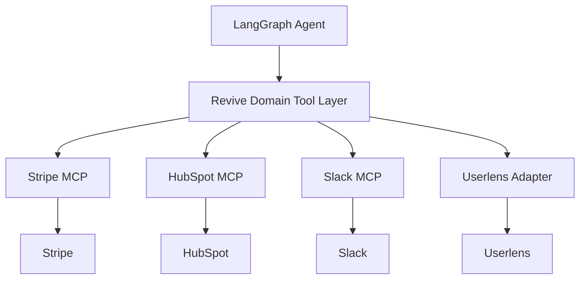

### Stripe

Used for financial truth:

- Customer
- Subscription
- Invoice
- Payment state
- Payment history
- Revenue impact

### HubSpot

Used for account and commercial context:

- Company
- Contacts
- Deals
- Owners
- Notes
- Tasks
- Engagements
- Associations

### Slack

Used for internal context and notifications:

- Search internal discussions
- Retrieve relevant messages
- Identify customer-related context
- Notify account owners

### Userlens

Used as behavioral evidence if a usable public MCP/API integration is available.

Userlens should not block the core workflow.

---

## 8. LangGraph Workflow

Revive is not a generic ReAct loop.

It is a controlled workflow with LLM reasoning inside specific nodes.

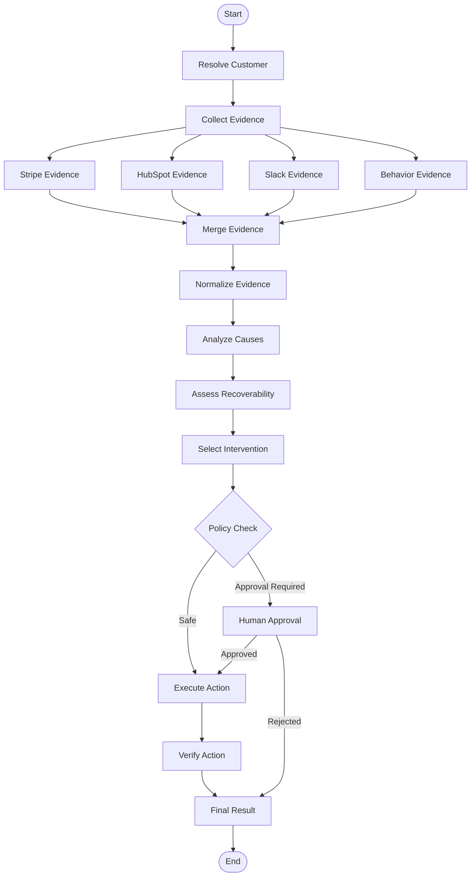

---

## 9. LangGraph State

The graph state should contain structured application state.

```python
class ReviveState(TypedDict, total=False):
    investigation_id: str
    customer_query: str
    user_id: str                 # whose connections to use in live mode
    created_at: str

    customer: CustomerContext | None
    evidence: list[Evidence]
    evidence_sources: dict[str, str]     # source -> "ok" | "empty" | "error: ..."

    diagnosis: Diagnosis | None
    recoverability: RecoverabilityDecision | None
    intervention: Intervention | None

    actions: list[Action]
    action_results: list[ActionResult]
    verification_results: list[VerificationResult]

    warnings: list[str]
    status: InvestigationStatus
```

The LLM should not own the entire state. Important business state remains structured and validated.

---

## 10. Evidence Model

Evidence is a first-class domain object.

```python
class Evidence:
    id: str
    source: Literal[
        "stripe",
        "hubspot",
        "slack",
        "userlens"
    ]

    category: Literal[
        "billing",
        "product_behavior",
        "crm",
        "communication"
    ]

    subject: str
    finding: str

    raw_reference: str | None
    timestamp: datetime | None

    confidence: float

    supports: list[str]
    contradicts: list[str]
```

Example:

```text
Source: Slack
Category: communication

Finding:
CSM reported onboarding frustration.

Supports:
PRODUCT_ADOPTION_FAILURE

Confidence:
0.91
```

This allows the final diagnosis to reference actual evidence.

---

## 11. Evidence Collection

Evidence collection should happen in parallel where possible.

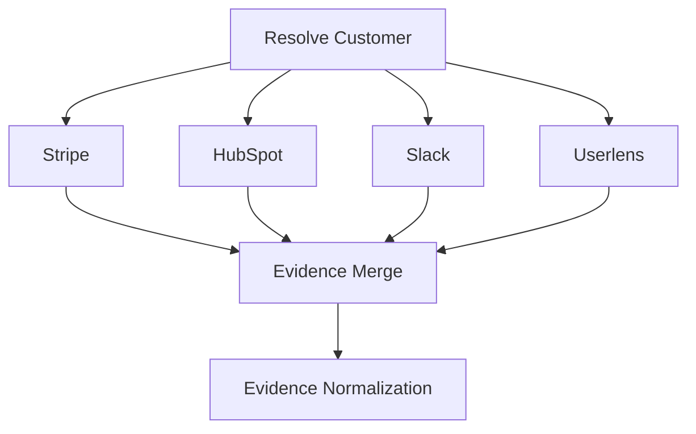

Each integration returns normalized evidence rather than vendor-specific objects.

Example:

```text
Stripe subscription object
        ↓
FinancialEvidence

HubSpot deal object
        ↓
CRMEvidence

Slack message
        ↓
CommunicationEvidence
```

---

## 12. Cause Analysis

Revive should not reduce the problem to a churn score.

The model receives a structured evidence bundle.

Example:

```text
Customer:
Acme Corp

Financial:
$36k ARR
Subscription ended
No payment failure

CRM:
Enterprise account
Renewal marked lost
Owner = Sarah

Behavior:
Usage down 67%
Feature X adoption low

Internal:
CSM reported onboarding frustration
```

The model produces structured hypotheses:

```json
{
  "category": "PRODUCT_ADOPTION",
  "confidence": 0.87,
  "supporting_evidence": [
    "ev_12",
    "ev_18",
    "ev_23"
  ],
  "contradicting_evidence": [],
  "reasoning": "..."
}
```

Evidence references are required.

---

## 13. Cause Taxonomy

Initial taxonomy:

```text
PRODUCT_ADOPTION
PRICING
PAYMENT
ORGANIZATIONAL_CHANGE
CUSTOMER_SUPPORT
PRODUCT_FIT
INSUFFICIENT_EVIDENCE
OTHER
```

The taxonomy should remain small for the MVP.

---

## 14. Recoverability

Recoverability combines LLM reasoning with deterministic policy.

Inputs:

```text
Revenue value
Product usage
Customer engagement
Cause confidence
Relationship health
Support history
Payment status
Contract state
Evidence completeness
Intervention cost
```

Output:

```text
RECOVERABLE
NOT_RECOVERABLE
INSUFFICIENT_EVIDENCE
```

The LLM explains the decision, but deterministic rules can override unsafe or unsupported conclusions.

---

## 15. Intervention Selection

Initial mapping:

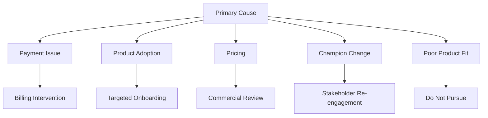

The recommendation should include:

- Action
- Reason
- Supporting evidence
- Expected outcome
- Risk
- Approval requirement

---

## 16. Action Policy

Actions are classified before execution.

### Safe internal actions

```text
Create HubSpot task
Update internal CRM metadata
Notify account owner in Slack
Store investigation result
```

### Approval-required actions

```text
Send customer email
Offer discount
Change subscription
Issue refund
Create financial transaction
```

This prevents the LLM from directly deciding whether a financial action is safe.

---

## 17. Human-in-the-Loop

LangGraph interrupts execution when approval is required.

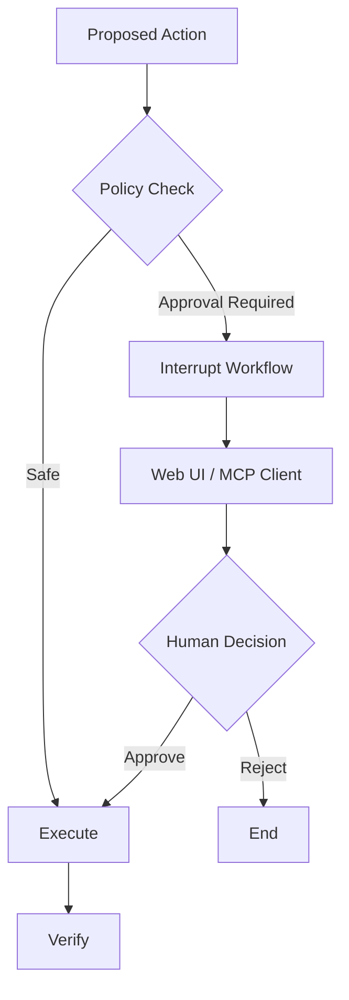

The approval state must be persisted.

Actions after an interrupt must be idempotent because the interrupted node may be re-entered when the workflow resumes.

---

## 18. Verification

Verification is mandatory for important writes.

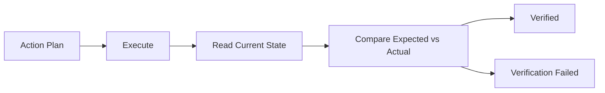

Example:

```text
Create HubSpot task
        ↓
Read task
        ↓
Check task ID / owner / title
        ↓
Verified
```

This gives Revive an explicit ACT → VERIFY loop.

---

## 19. Application Services

REST and MCP should call application services instead of LangGraph nodes directly.

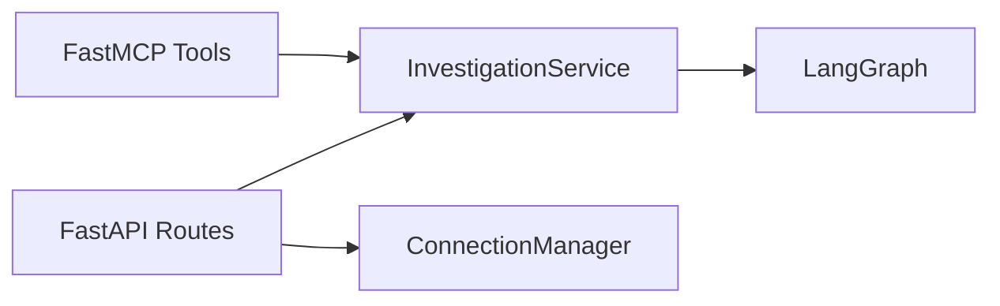

`InvestigationService` is the single entry point behind both transports (start, resume, get, list,
and the SSE streams); `ConnectionManager` handles encrypted per-user provider credentials. This keeps
transport concerns separate from business logic.

---

## 20. Domain Tool Layer

The agent should use Revive-level tools.

```text
investigate_billing(customer)
investigate_account(customer)
investigate_internal_context(customer)
investigate_behavior(customer)

create_recovery_task(...)
notify_account_owner(...)

verify_recovery_task(...)
verify_notification(...)
```

Internally these tools use MCP clients.

Example:

```text
investigate_billing()
        ↓
Stripe MCP
        ↓
Stripe API
```

The agent therefore remains independent of vendor-specific tool names.

---

## 21. Database

PostgreSQL is the only stateful dependency. It stores both the LangGraph checkpoints (durable graph
state, keyed by investigation id) and the queryable application tables:

```text
investigations     summary + full result JSON per investigation
audit_events       the ordered investigation trace
connections        per-user provider credentials (Fernet-encrypted)
```

The checkpoint tables are managed by the LangGraph Postgres checkpointer; the application tables are
managed with SQLAlchemy. There is no Redis: the system has no cache or coordination requirement on the
correctness path.

---

## 22. Investigation Lifecycle

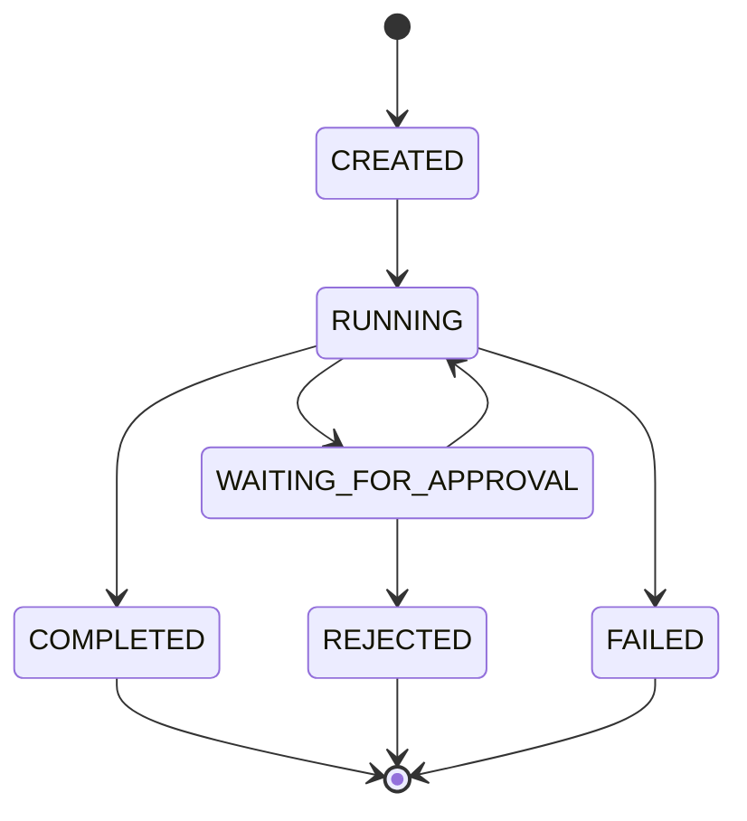

---

## 23. Audit Trail

Every investigation should retain:

```text
investigation_id
run_id
customer
source queried
evidence retrieved
hypotheses
decision
recommended action
executed action
approval event
verification result
timestamp
error/retry information
```

This supports debugging, evaluation and the hackathon reliability report.

---

## 24. Evaluation

Evaluation is built into the product.

Initial scenarios:

```text
Payment failure
Product adoption failure
Pricing objection
Champion departure
Poor product fit
Insufficient evidence
```

Each scenario has expected outcomes.

Example:

```json
{
  "primary_cause": "PRODUCT_ADOPTION",
  "recoverability": "RECOVERABLE",
  "recommended_action": "TARGETED_ONBOARDING",
  "financial_impact": 36000
}
```

Metrics:

```text
Cause accuracy
Recoverability accuracy
Evidence attribution accuracy
Action-selection accuracy
False-action rate
Verification success rate
Approval compliance
```

LangSmith is used for tracing and evaluation of agent runs.

---

## 25. Technology Stack

### Backend

```text
Python 3.13+
FastAPI
Uvicorn
Pydantic v2
```

### Agent

```text
LangGraph
LangChain
langchain-huggingface   (LLM reasoning)
LangSmith               (tracing)
```

### MCP

```text
FastMCP                 (Revive MCP server + upstream MCP client)
Stripe MCP / API
HubSpot MCP / API
Slack MCP / API
Arga Labs               (service twins for live tool validation)
```

### Database

```text
PostgreSQL
SQLAlchemy 2 (asyncpg)
psycopg                 (LangGraph Postgres checkpointer)
cryptography (Fernet)   (credential encryption)
```

### Frontend

```text
Next.js 16 (App Router)
React 19
TypeScript
Tailwind CSS v4
lucide-react
```

### Transport

```text
REST
SSE
MCP over HTTP
```

### Deployment

```text
Docker            (Postgres + backend + tunnel)
Cloudflare Tunnel (public HTTPS for the backend)
Vercel            (frontend)
```

---

## 26. Suggested Repository Structure

```text
Revive/
├── backend/
│   ├── app/
│   │   ├── main.py              # FastAPI + FastMCP mounted at /mcp
│   │   ├── config.py
│   │   ├── api/routes/          # health, investigations, approvals, connections, customers
│   │   ├── mcp/server.py        # Revive MCP server (4 curated tools)
│   │   ├── agent/               # state.py, nodes.py, graph.py, llm.py, prompts.py
│   │   ├── domain/
│   │   │   ├── models/          # customer, evidence, diagnosis, recovery, action, connection
│   │   │   ├── services/        # investigation, connection_manager
│   │   │   └── policies/        # action_policy
│   │   ├── integrations/
│   │   │   ├── base.py          # provider Protocols
│   │   │   ├── factory.py
│   │   │   ├── seed/            # deterministic fixtures + provider
│   │   │   ├── mcp/             # McpClient + live providers
│   │   │   └── arga/            # Arga Labs twin orchestrator
│   │   ├── persistence/         # checkpoint, db, models, repositories
│   │   └── evaluation/          # scenarios, metrics, runner
│   ├── scripts/                 # serve, run_slice, run_eval, run_live, arga_twin
│   ├── tests/
│   ├── docs/                    # API.md, ARGA-integration.md
│   ├── Dockerfile
│   └── pyproject.toml
├── frontend/                    # Next.js 16 investigation workspace (Vercel)
├── docs/                        # DEPLOY.md, langgraph-workflow.png
├── docker-compose.yml           # Postgres + backend + Cloudflare tunnel
├── PRD.md / HLD.md / LLD.md
└── README.md
```

---

## 27. End-to-End Example

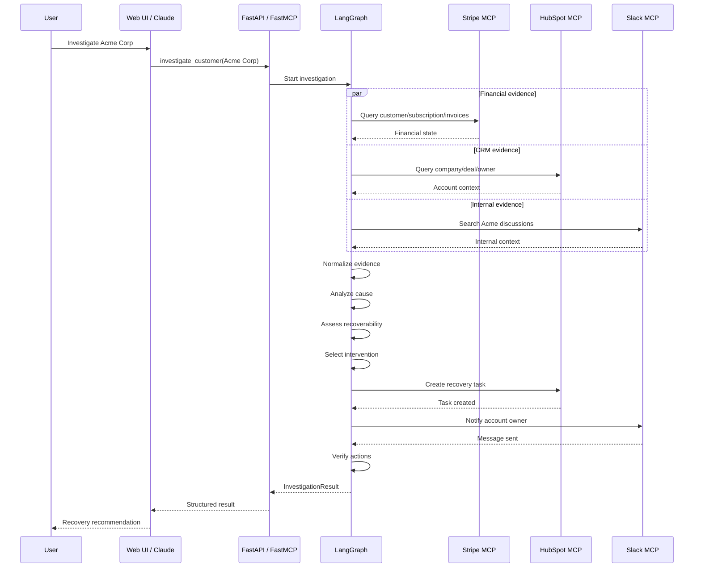

---

## 28. MVP Boundary

### Must have

```text
Stripe MCP
HubSpot MCP
Slack MCP

LangGraph investigation workflow

Evidence normalization

Cause analysis

Recoverability decision

Intervention recommendation

HubSpot task creation

Slack notification

Action verification

Human approval flow

Web UI

Revive MCP server

Evaluation scenarios
```

### Should have

```text
Userlens behavioral evidence
Streaming investigation events
Rich evidence timeline
LangSmith evaluation dashboard
```

### Not required for MVP

```text
Complex multi-tenant billing
Full RBAC
Production-grade billing
Large-scale event processing
Autonomous customer email
Automatic discounts
Complex CRM synchronization
Multiple LLM providers
```

---

## 29. Core Product Loop

Revive's architecture should ultimately reinforce one simple loop:

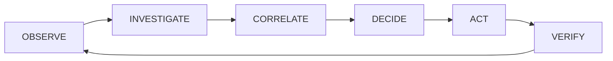

The product is not just:

```text
Customer churned → generate email
```

It is:

```text
Revenue was lost
        ↓
What happened?
        ↓
Why did it happen?
        ↓
Is recovery rational?
        ↓
What should we do?
        ↓
Can we safely do it?
        ↓
Did it actually happen?
```

That loop is the core of Revive.
