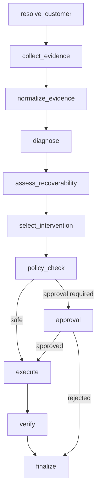
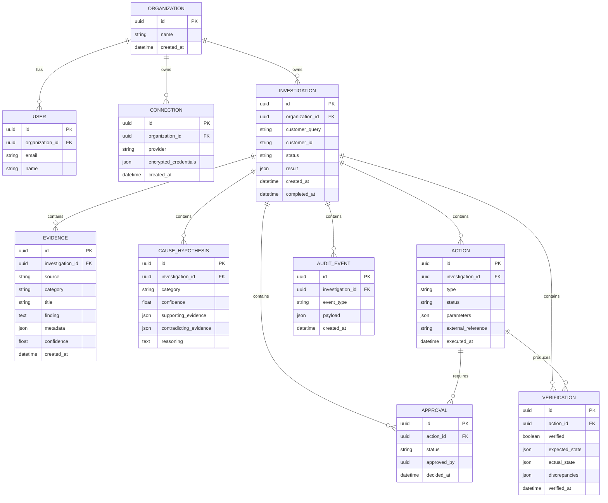
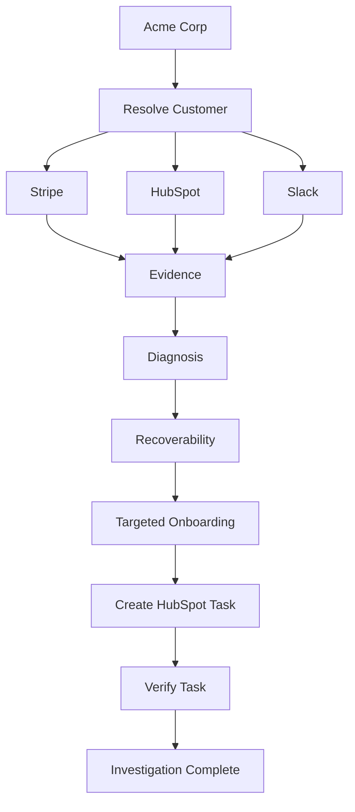

Yes. We should make the LLD concrete enough that we can move directly into implementation without making architectural decisions while coding.

I would structure the LLD around **six contracts**:

1. LangGraph state and nodes
2. Domain models
3. MCP integration interfaces
4. Application/service interfaces
5. REST + Revive MCP contracts
6. Persistence schema

Then we can define the exact implementation order.

# Revive LLD

## 1. Package Architecture

```text
├── frontend
├── backend
    └── app/
        ├── main.py
        │
        ├── api/
        │   ├── routes/
        │   │   ├── investigations.py
        │   │   ├── approvals.py
        │   │   └── health.py
        │   └── schemas/
        │
        ├── mcp/
        │   ├── server.py
        │   └── tools/
        │       ├── investigation.py
        │       ├── recovery.py
        │       └── verification.py
        │
        ├── agent/
        │   ├── graph.py
        │   ├── state.py
        │   ├── nodes/
        │   │   ├── resolve_customer.py
        │   │   ├── collect_evidence.py
        │   │   ├── normalize_evidence.py
        │   │   ├── diagnose.py
        │   │   ├── recoverability.py
        │   │   ├── intervention.py
        │   │   ├── policy.py
        │   │   ├── approval.py
        │   │   ├── execute.py
        │   │   └── verify.py
        │   └── prompts/
        │
        ├── domain/
        │   ├── models/
        │   │   ├── customer.py
        │   │   ├── evidence.py
        │   │   ├── diagnosis.py
        │   │   ├── recovery.py
        │   │   └── action.py
        │   ├── services/
        │   │   ├── investigation.py
        │   │   ├── recovery.py
        │   │   └── verification.py
        │   └── policies/
        │       └── action_policy.py
        │
        ├── integrations/
        │   ├── base.py
        │   ├── stripe/
        │   │   └── client.py
        │   ├── hubspot/
        │   │   └── client.py
        │   ├── slack/
        │   │   └── client.py
        │   └── userlens/
        │       └── client.py
        │
        ├── persistence/
        │   ├── models.py
        │   ├── repositories.py
        │   └── checkpoint.py
        │
        ├── evaluation/
        │   ├── scenarios.py
        │   ├── assertions.py
        │   └── runner.py
        │
        └── config.py
```

The important dependency direction is:

```text
API / MCP
    ↓
Application Services
    ↓
LangGraph / Domain
    ↓
Integration Interfaces
    ↓
MCP Clients
```

The domain layer should not import FastAPI or vendor-specific SDKs.

---

# 2. Core Domain Models

## CustomerContext

```python
class CustomerContext(BaseModel):
    id: str
    name: str

    annual_revenue: Decimal | None
    currency: str | None

    renewal_date: datetime | None
    renewal_status: str | None

    owner_id: str | None
    owner_name: str | None
```

We deliberately keep this normalized.

The Stripe customer ID, HubSpot company ID, etc. belong in integration-specific metadata.

---

# 3. Evidence

This is one of the most important models.

```python
class EvidenceSource(str, Enum):
    STRIPE = "stripe"
    HUBSPOT = "hubspot"
    SLACK = "slack"
    USERLENS = "userlens"


class EvidenceCategory(str, Enum):
    BILLING = "billing"
    PRODUCT_BEHAVIOR = "product_behavior"
    CRM = "crm"
    COMMUNICATION = "communication"


class Evidence(BaseModel):
    id: str

    source: EvidenceSource
    category: EvidenceCategory

    title: str
    finding: str

    source_reference: str | None
    timestamp: datetime | None

    confidence: float

    supports: list[str] = []
    contradicts: list[str] = []
```

Example:

```json
{
  "id": "ev_023",
  "source": "slack",
  "category": "communication",
  "title": "Onboarding frustration",
  "finding": "CSM reported that Acme struggled with onboarding.",
  "source_reference": "slack:msg:abc123",
  "confidence": 0.91,
  "supports": ["PRODUCT_ADOPTION"]
}
```

---

# 4. Diagnosis Model

```python
class CauseCategory(str, Enum):
    PRODUCT_ADOPTION = "product_adoption"
    PRICING = "pricing"
    PAYMENT = "payment"
    ORGANIZATIONAL_CHANGE = "organizational_change"
    CUSTOMER_SUPPORT = "customer_support"
    PRODUCT_FIT = "product_fit"
    INSUFFICIENT_EVIDENCE = "insufficient_evidence"
    OTHER = "other"
```

```python
class CauseHypothesis(BaseModel):
    category: CauseCategory

    confidence: float

    supporting_evidence_ids: list[str]
    contradicting_evidence_ids: list[str]

    reasoning: str
```

Then:

```python
class Diagnosis(BaseModel):
    primary_cause: CauseHypothesis
    alternatives: list[CauseHypothesis]

    confidence: float
```

---

# 5. Recoverability Model

```python
class Recoverability(str, Enum):
    RECOVERABLE = "recoverable"
    NOT_RECOVERABLE = "not_recoverable"
    INSUFFICIENT_EVIDENCE = "insufficient_evidence"
```

```python
class RecoverabilityDecision(BaseModel):
    decision: Recoverability

    confidence: float

    factors: dict[str, float]

    reasoning: str

    supporting_evidence_ids: list[str]
```

Example:

```json
{
  "decision": "recoverable",
  "confidence": 0.82,
  "factors": {
    "revenue_value": 0.9,
    "product_fit": 0.8,
    "relationship": 0.7,
    "cause_confidence": 0.87
  }
}
```

---

# 6. Intervention Model

```python
class InterventionType(str, Enum):
    BILLING_INTERVENTION = "billing_intervention"
    TARGETED_ONBOARDING = "targeted_onboarding"
    COMMERCIAL_REVIEW = "commercial_review"
    STAKEHOLDER_REENGAGEMENT = "stakeholder_reengagement"
    SUPPORT_ESCALATION = "support_escalation"
    DO_NOT_PURSUE = "do_not_pursue"
```

```python
class Intervention(BaseModel):
    type: InterventionType

    priority: Literal["low", "medium", "high"]

    reason: str

    expected_outcome: str

    risk: str

    supporting_evidence_ids: list[str]

    approval_required: bool
```

---

# 7. Action Model

Every side effect becomes an explicit action.

```python
class ActionType(str, Enum):
    CREATE_CRM_TASK = "create_crm_task"
    SEND_INTERNAL_NOTIFICATION = "send_internal_notification"
    SEND_CUSTOMER_MESSAGE = "send_customer_message"
    UPDATE_CRM = "update_crm"
    FINANCIAL_MUTATION = "financial_mutation"
```

```python
class Action(BaseModel):
    id: str

    type: ActionType

    description: str

    parameters: dict

    approval_required: bool

    status: str
```

And execution:

```python
class ActionResult(BaseModel):
    action_id: str

    success: bool

    external_reference: str | None

    message: str | None

    executed_at: datetime
```

---

# 8. Verification

```python
class VerificationResult(BaseModel):
    action_id: str

    verified: bool

    expected_state: dict
    actual_state: dict

    discrepancies: list[str]

    verified_at: datetime
```

This allows the UI to say:

```text
HubSpot task
✓ Created
✓ Verified

Slack notification
✓ Sent
✓ Verified
```

rather than simply trusting an API response.

---

# 9. LangGraph State

Now combine these models into the graph state.

```python
class ReviveState(TypedDict):
    investigation_id: str

    customer_query: str
    customer: CustomerContext | None

    financial_state: FinancialState | None
    crm_state: CRMState | None
    communication_state: CommunicationState | None
    behavior_state: BehaviorState | None

    evidence: list[Evidence]

    hypotheses: list[CauseHypothesis]
    diagnosis: Diagnosis | None

    recoverability: RecoverabilityDecision | None
    intervention: Intervention | None

    actions: list[Action]
    action_results: list[ActionResult]

    approval_status: ApprovalStatus | None

    verification_results: list[VerificationResult]

    warnings: list[str]

    status: InvestigationStatus
```

---

# 10. LangGraph Nodes

Each node should have one responsibility.

### `resolve_customer`

Input:

```text
customer_query
```

Output:

```text
customer
```

Responsibilities:

* Find customer
* Resolve cross-system identifiers
* Detect ambiguity
* Fail safely if customer cannot be resolved

---

### `collect_evidence`

Fan out into:

```text
Stripe
HubSpot
Slack
Userlens
```

These should run concurrently.

Each integration returns normalized evidence.

---

### `normalize_evidence`

Responsibilities:

```text
Remove duplicate evidence
Normalize timestamps
Normalize source references
Validate confidence
Assign evidence IDs
```

---

### `diagnose`

LLM node.

Input:

```text
CustomerContext
Evidence[]
```

Output:

```text
Diagnosis
```

Strict structured output.

No direct side effects.

---

### `assess_recoverability`

Input:

```text
Diagnosis
Evidence
CustomerContext
FinancialState
```

Output:

```text
RecoverabilityDecision
```

This combines deterministic scoring and LLM reasoning.

---

### `select_intervention`

Input:

```text
Diagnosis
Recoverability
Evidence
```

Output:

```text
Intervention
```

---

### `policy_check`

This should be deterministic.

```python
def requires_approval(action: Action) -> bool:
    return action.type in {
        ActionType.SEND_CUSTOMER_MESSAGE,
        ActionType.FINANCIAL_MUTATION,
    }
```

No LLM involvement.

---

### `approval`

Use LangGraph `interrupt()`.

```python
decision = interrupt({
    "type": "approval_required",
    "action": action.model_dump(),
    "reason": action.description
})
```

---

### `execute`

Execute only approved/safe actions.

---

### `verify`

Query the relevant integration again and compare expected vs actual state.

---

# 11. Graph Construction

Conceptually:

```python
builder.add_node("resolve_customer", resolve_customer)
builder.add_node("collect_evidence", collect_evidence)
builder.add_node("normalize_evidence", normalize_evidence)
builder.add_node("diagnose", diagnose)
builder.add_node("assess_recoverability", assess_recoverability)
builder.add_node("select_intervention", select_intervention)
builder.add_node("policy_check", policy_check)
builder.add_node("approval", approval)
builder.add_node("execute", execute)
builder.add_node("verify", verify)
```

Edges:



---

# 12. MCP Integration Interfaces

This is where we keep vendor details isolated.

```python
class BillingProvider(Protocol):

    async def find_customer(
        self,
        query: str
    ) -> CustomerReference:
        ...

    async def get_subscription(
        self,
        customer_id: str
    ) -> SubscriptionState:
        ...

    async def get_invoices(
        self,
        customer_id: str
    ) -> list[InvoiceState]:
        ...

    async def get_payment_state(
        self,
        customer_id: str
    ) -> PaymentState:
        ...
```

Stripe MCP implements this interface.

---

## HubSpot

```python
class CRMProvider(Protocol):

    async def find_company(
        self,
        query: str
    ) -> CompanyReference:
        ...

    async def get_account_context(
        self,
        company_id: str
    ) -> CRMState:
        ...

    async def create_task(
        self,
        task: CreateTaskRequest
    ) -> ActionResult:
        ...

    async def get_task(
        self,
        task_id: str
    ) -> TaskState:
        ...
```

---

## Slack

```python
class CommunicationProvider(Protocol):

    async def search(
        self,
        query: str
    ) -> list[Message]:
        ...

    async def send_internal_message(
        self,
        channel: str,
        message: str
    ) -> ActionResult:
        ...

    async def get_message(
        self,
        reference: str
    ) -> Message:
        ...
```

---

# 13. MCP Clients

The integration implementation wraps the actual MCP client.

```text
StripeProvider
      ↓
MCP Client
      ↓
Stripe MCP
```

For example:

```python
class StripeMCPProvider(BillingProvider):

    def __init__(self, client: Client):
        self.client = client

    async def get_subscription(self, customer_id):
        result = await self.client.call_tool(
            "stripe_api_read",
            ...
        )

        return normalize_subscription(result)
```

The exact vendor tool names remain isolated here.

If Stripe changes its MCP surface, only this layer changes.

---

# 14. Application Services

## InvestigationService

```python
class InvestigationService:

    async def start(
        self,
        request: InvestigationRequest
    ) -> Investigation:
        ...
```

Responsibilities:

```text
Create investigation
Create LangGraph run
Persist initial state
Start workflow
Return investigation ID
```

---

## RecoveryService

```python
class RecoveryService:

    async def execute(
        self,
        investigation_id: str
    ) -> RecoveryResult:
        ...
```

---

## VerificationService

```python
class VerificationService:

    async def verify(
        self,
        action_id: str
    ) -> VerificationResult:
        ...
```

---

# 15. REST API

## Start Investigation

```http
POST /api/v1/investigations
```

Request:

```json
{
  "customer": "Acme Corp"
}
```

Response:

```json
{
  "investigation_id": "inv_123",
  "status": "running"
}
```

---

## Get Investigation

```http
GET /api/v1/investigations/inv_123
```

Response:

```json
{
  "id": "inv_123",
  "status": "completed",
  "customer": {
    "name": "Acme Corp"
  },
  "revenue_impact": 36000,
  "diagnosis": {},
  "recoverability": {},
  "intervention": {},
  "actions": [],
  "verification": []
}
```

---

## Investigation Events

```http
GET /api/v1/investigations/inv_123/events
```

Use SSE.

Example events:

```text
customer_resolved
evidence_source_started
evidence_source_completed
diagnosis_started
diagnosis_completed
approval_required
action_executed
action_verified
investigation_completed
```

---

# 16. Revive MCP Contract

The public MCP should map to application services.

### `revive.investigate_customer`

```json
{
  "customer": "Acme Corp"
}
```

Returns:

```json
{
  "investigation_id": "inv_123",
  "status": "completed",
  "revenue_at_risk": 36000,
  "primary_cause": "PRODUCT_ADOPTION",
  "confidence": 0.87,
  "recoverability": "RECOVERABLE",
  "recommended_intervention": "TARGETED_ONBOARDING",
  "evidence": [],
  "actions": []
}
```

### `revive.get_investigation`

```json
{
  "investigation_id": "inv_123"
}
```

### `revive.get_evidence`

```json
{
  "investigation_id": "inv_123"
}
```

### `revive.get_recovery_recommendation`

```json
{
  "investigation_id": "inv_123"
}
```

### `revive.execute_recovery`

```json
{
  "investigation_id": "inv_123",
  "action_ids": [
    "action_123"
  ]
}
```

### `revive.verify_recovery`

```json
{
  "investigation_id": "inv_123"
}
```

---

# 17. Important MCP Design Decision

There is one subtle issue here.

If Claude calls:

```text
revive.investigate_customer()
```

and the workflow takes 30 seconds, we don't want an MCP request to become an enormous blocking operation.

So internally:

```text
MCP call
   ↓
create investigation
   ↓
run LangGraph
   ↓
return structured result
```

For the hackathon, this is acceptable if our entire investigation is reasonably fast.

For the production architecture, we should support:

```text
revive.investigate_customer
        ↓
investigation_id
        ↓
revive.get_investigation
```

This also makes the workflow naturally resumable.

---

# 18. Persistence Schema

I'd use these core tables.



For the hackathon, some of the JSON columns can remain flexible rather than creating excessive normalization.

---

# 19. Credential Architecture

Do not store raw MCP credentials in the LangGraph state.

Use:

```text
connections
    ↓
ConnectionManager
    ↓
MCP client
```

LangGraph state only contains:

```text
connection_id
```

Never:

```text
access_token
refresh_token
api_key
```

This is especially important because LangGraph state/checkpoints may persist for a long time.

---

# 20. Idempotency

Every external write should have an idempotency strategy.

For example:

```text
investigation_id + action_id
```

can become the internal idempotency key.

Before creating a HubSpot task:

```text
Does action_id already have external_reference?
    YES → return existing result
    NO  → execute
```

This protects us from duplicate actions after retries or graph resumption.

---

# 21. Error Handling

Each integration should return typed failures.

```python
class IntegrationError(Exception):
    provider: str
    operation: str
    retryable: bool
```

Examples:

```text
Stripe timeout
    → retry

Slack rate limit
    → retry with backoff

HubSpot authorization failure
    → fail investigation safely

Customer not found
    → stop investigation

Ambiguous customer
    → ask user / stop
```

Do not let the LLM decide whether an infrastructure error is retryable.

---

# 22. Reliability Boundaries

The workflow should distinguish:

```text
Agent failure
Integration failure
Policy failure
Action failure
Verification failure
```

Example:

```text
Stripe unavailable
    ↓
Financial evidence unavailable
    ↓
Cannot confidently determine revenue impact
    ↓
Recoverability = INSUFFICIENT_EVIDENCE
```

Do not allow the model to fill the missing Stripe data from assumptions.

---

# 23. Prompt Architecture

Keep prompts separated by task.

```text
prompts/
├── diagnosis.txt
├── recoverability.txt
├── intervention.txt
└── final_report.txt
```

Each prompt should define:

```text
Role
Input schema
Reasoning constraints
Output schema
Evidence requirements
Forbidden behavior
```

For example:

```text
You are the diagnosis component of Revive.

Determine the most likely reason for non-renewal.

Rules:
1. Use only supplied evidence.
2. Every conclusion must reference evidence IDs.
3. Consider contradictory evidence.
4. Do not invent facts.
5. Return structured output.
6. If evidence is insufficient, return INSUFFICIENT_EVIDENCE.
```

---

# 24. LLM Structured Output

Do not parse free-form text.

Use Pydantic schemas:

```python
structured_llm = llm.with_structured_output(Diagnosis)
```

Then:

```text
LLM
 ↓
Diagnosis schema
 ↓
Pydantic validation
 ↓
LangGraph state
```

This significantly reduces fragile parsing.

---

# 25. Evaluation Harness

Each scenario should define:

```python
class EvaluationScenario(BaseModel):
    name: str

    customer: str

    expected_cause: CauseCategory
    expected_recoverability: Recoverability
    expected_intervention: InterventionType

    expected_revenue_impact: Decimal
```

Runner:

```text
Scenario
   ↓
Revive
   ↓
InvestigationResult
   ↓
Assertions
   ↓
Metrics
```

This lets us run the same graph against:

```text
Acme
Beta
Gamma
Delta
Epsilon
```

without changing agent code.

---

# 26. Recommended Build Order

Now that HLD and LLD are defined, **do not start with the UI**.

Build in this order:

```mermaid
flowchart LR
    A["Project Skeleton"]
    B["MCP Connections"]
    C["Demo Data"]
    D["Domain Models"]
    E["Integration Layer"]
    F["LangGraph"]
    G["Persistence"]
    H["REST API"]
    I["Revive MCP"]
    J["Evaluation"]
    K["UI"]
    L["Reliability / Demo"]

    A --> B
    B --> C
    C --> D
    D --> E
    E --> F
    F --> G
    G --> H
    H --> I
    I --> J
    J --> K
    K --> L
```



### Phase 1

Create the Python project and connect:

```text
Stripe MCP
HubSpot MCP
Slack MCP
```

Verify authentication and actual calls.

### Phase 2

Create the demo customer data.

Start with **Acme only**.

### Phase 3

Implement the domain models and provider interfaces.

### Phase 4

Implement the vertical slice:

```text
Acme
 ↓
Stripe
 ↓
HubSpot
 ↓
Slack
 ↓
Diagnosis
 ↓
Recoverability
 ↓
Recommendation
```

### Phase 5

Add:

```text
HubSpot task
Slack notification
Verification
```

### Phase 6

Add human approval.

### Phase 7

Expose the same workflow through FastAPI and FastMCP.

### Phase 8

Add the other scenarios and evaluation.

### Phase 9

Build the UI around the already-working backend.

---

# 27. The First Vertical Slice

Before implementing the complete graph, our first successful run should be:



If this works end to end, **we have the product**.

Everything else is expansion, reliability, evaluation, and presentation.

The key LLD decision I would lock is therefore:

> **LangGraph owns orchestration, domain services own business semantics, integration providers own MCP/vendor details, and FastAPI/FastMCP are thin transport layers.**

That separation gives us enough structure to build quickly without turning a six-hour hackathon project into an over-engineered distributed system.
