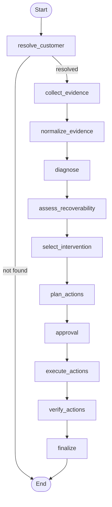
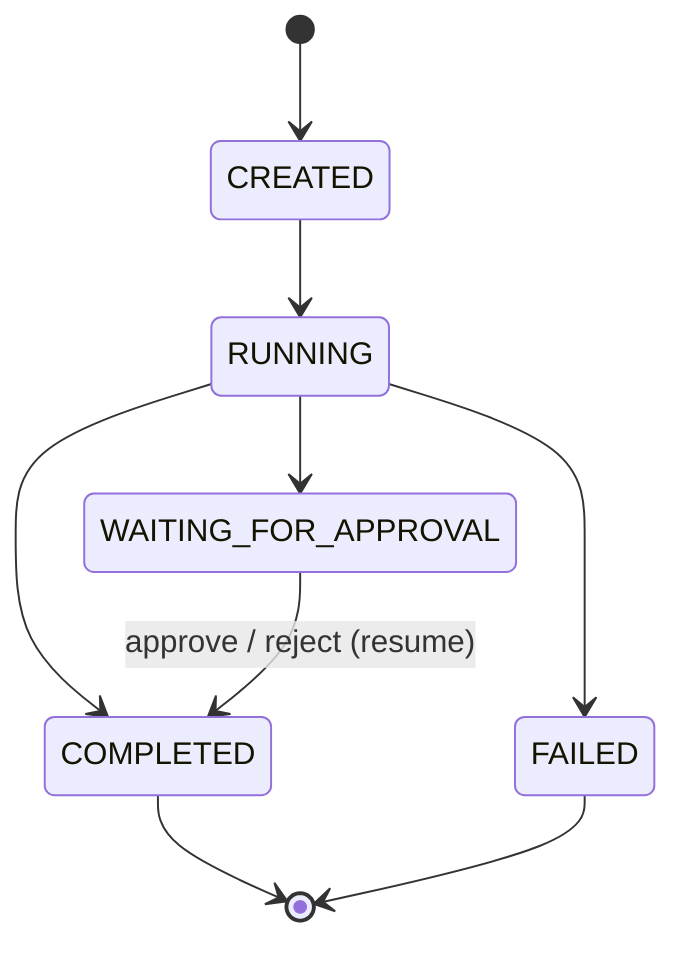
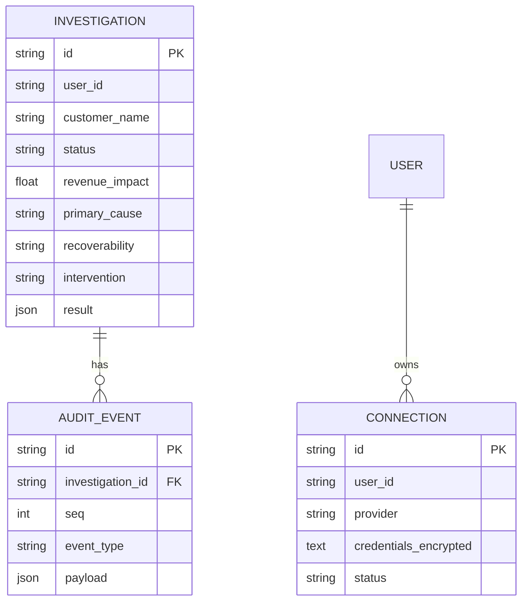

# Revive Low-Level Design (LLD)

## 1. Overview

This document describes how Revive is built. It complements the [HLD](HLD.md), which covers the
architecture and principles, by specifying the concrete contracts: package layout, domain models,
the LangGraph state machine, the provider layer, application services, persistence, the REST and
MCP surfaces, and the evaluation harness. Where the HLD says what the system does, the LLD says how.

The design holds one boundary firm:

> LangGraph owns orchestration, application services own business semantics, provider interfaces own
> vendor and MCP details, and FastAPI and FastMCP are thin transport layers.

That separation is what lets the same workflow run identically for a human on the web and for an AI
client over MCP, in a deterministic demo mode or against live tools.

---

## 2. Package Architecture

```text
backend/app/
├── main.py              # ASGI app: FastAPI + FastMCP mounted at /mcp, lifespan, CORS
├── config.py            # Settings (env), Windows event-loop policy, log filtering
│
├── api/
│   ├── dependencies.py  # get_current_user_id (X-User-Id stub auth)
│   ├── schemas.py       # request bodies
│   └── routes/          # health, investigations, approvals, connections, customers
│
├── mcp/
│   └── server.py        # Revive MCP server: curated business tools
│
├── agent/
│   ├── state.py         # ReviveState (TypedDict)
│   ├── nodes.py         # all workflow nodes
│   ├── graph.py         # graph construction + compile (singleton, checkpointer)
│   ├── llm.py           # HuggingFace chat model + structured diagnosis
│   └── prompts.py       # LLM prompts
│
├── domain/
│   ├── models/          # customer, evidence, diagnosis, recovery, action, connection
│   ├── services/        # investigation, connection_manager
│   └── policies/        # action_policy (deterministic approval classification)
│
├── integrations/
│   ├── base.py          # provider Protocols
│   ├── factory.py       # seed vs live selection
│   ├── seed/            # deterministic fixtures + provider
│   ├── mcp/             # McpClient + live providers
│   └── arga/            # Arga Labs twin orchestrator
│
├── persistence/
│   ├── checkpoint.py    # LangGraph checkpointer (Postgres or memory)
│   ├── db.py            # SQLAlchemy async engine + Base
│   ├── models.py        # ConnectionRow, InvestigationRow, AuditEventRow
│   └── repositories.py  # InvestigationRepository, AuditRepository
│
└── evaluation/
    ├── scenarios.py     # expected outcomes (derived from fixtures)
    ├── metrics.py       # ScenarioResult, EvalReport, build_report
    └── runner.py        # run_eval, evaluate_scenario
```

The dependency direction is one-way:

```text
API / MCP transports
        ↓
Application services
        ↓
LangGraph / domain
        ↓
Provider interfaces
        ↓
Seed fixtures  |  MCP clients (live)
```

The domain layer imports neither FastAPI nor vendor SDKs. Transports and providers depend inward on
the domain, never the reverse.

---

## 3. Domain Models

All domain state is Pydantic v2. Every enum value is lowercase snake_case and is emitted verbatim on
the wire, so the frontend and MCP clients bind to stable strings.

### Customer

```python
class CustomerContext(BaseModel):
    id: str
    name: str
    annual_revenue: Decimal | None
    currency: str | None
    renewal_date: datetime | None
    renewal_status: str | None
    owner_id: str | None
    owner_name: str | None
    external_ids: dict[str, str]   # {"stripe": "cus_...", "hubspot": "..."}
```

The customer is normalized. Vendor identifiers live in `external_ids`, so the graph never carries a
Stripe-shaped or HubSpot-shaped object.

### Evidence

Evidence is the first-class object of the system. Every conclusion downstream references it by id.

```python
class EvidenceSource(str, Enum):
    STRIPE = "stripe"; HUBSPOT = "hubspot"; SLACK = "slack"; USERLENS = "userlens"

class EvidenceCategory(str, Enum):
    BILLING = "billing"; PRODUCT_BEHAVIOR = "product_behavior"
    CRM = "crm"; COMMUNICATION = "communication"

class Evidence(BaseModel):
    id: str
    source: EvidenceSource
    category: EvidenceCategory
    title: str
    finding: str
    source_reference: str | None
    timestamp: datetime | None
    confidence: float
    supports: list[str]      # cause categories this evidence supports
    contradicts: list[str]   # cause categories this evidence argues against
```

`supports` and `contradicts` carry cause-category tags. They are what make the diagnosis reproducible
without an LLM (Section 6) and what let the UI draw the link from a cause back to its evidence.

### Diagnosis

```python
class CauseCategory(str, Enum):
    PRODUCT_ADOPTION; PRICING; PAYMENT; ORGANIZATIONAL_CHANGE
    CUSTOMER_SUPPORT; PRODUCT_FIT; INSUFFICIENT_EVIDENCE; OTHER

class CauseHypothesis(BaseModel):
    category: CauseCategory
    confidence: float
    supporting_evidence_ids: list[str]
    contradicting_evidence_ids: list[str]
    reasoning: str

class Diagnosis(BaseModel):
    primary_cause: CauseHypothesis
    alternatives: list[CauseHypothesis]
    confidence: float
```

Every hypothesis must reference evidence ids. `INSUFFICIENT_EVIDENCE` is a first-class outcome: the
diagnosis is allowed to decline rather than invent a cause.

### Recoverability and Intervention

```python
class Recoverability(str, Enum):
    RECOVERABLE; NOT_RECOVERABLE; INSUFFICIENT_EVIDENCE

class RecoverabilityDecision(BaseModel):
    decision: Recoverability
    confidence: float
    factors: dict[str, float]        # e.g. {"revenue_value": 0.9, "cause_confidence": 0.9}
    reasoning: str
    supporting_evidence_ids: list[str]

class InterventionType(str, Enum):
    BILLING_INTERVENTION; TARGETED_ONBOARDING; COMMERCIAL_REVIEW
    STAKEHOLDER_REENGAGEMENT; SUPPORT_ESCALATION; DO_NOT_PURSUE

class Intervention(BaseModel):
    type: InterventionType
    priority: Literal["low", "medium", "high"]
    reason: str
    expected_outcome: str
    risk: str
    supporting_evidence_ids: list[str]
    approval_required: bool
```

### Action, Result, Verification

Every side effect is an explicit action, separate from its execution result and its verification.

```python
class ActionType(str, Enum):
    CREATE_CRM_TASK; SEND_INTERNAL_NOTIFICATION; UPDATE_CRM
    SEND_CUSTOMER_MESSAGE; FINANCIAL_MUTATION

class ActionStatus(str, Enum):
    PROPOSED; APPROVED; REJECTED; EXECUTED; FAILED; VERIFIED

class Action(BaseModel):
    id: str
    type: ActionType
    description: str
    parameters: dict
    approval_required: bool
    status: ActionStatus

class ActionResult(BaseModel):
    action_id: str
    success: bool
    external_reference: str | None   # vendor handle used later to verify
    message: str | None
    executed_at: datetime

class VerificationResult(BaseModel):
    action_id: str
    verified: bool
    expected_state: dict
    actual_state: dict
    discrepancies: list[str]
    verified_at: datetime
```

### Connection

Per-user provider credentials. The public model never carries the secret.

```python
class ConnectionProvider(str, Enum):
    STRIPE; HUBSPOT; SLACK

class ConnectionCreate(BaseModel):
    provider: ConnectionProvider
    credentials: dict[str, str]   # {"api_key": "..."} or {"token": "...", "base_url": "..."}
    scopes: list[str]

class Connection(BaseModel):          # public view; no credentials
    id: str
    provider: ConnectionProvider
    status: ConnectionStatus
    scopes: list[str]
    created_at: datetime
    updated_at: datetime
```

---

## 4. LangGraph State

The graph state combines the models above. It is a plain `TypedDict` (nodes run sequentially, so no
concurrent-write reducers are needed), and it holds domain model instances rather than loose dicts.

```python
class ReviveState(TypedDict, total=False):
    investigation_id: str
    customer_query: str
    user_id: str                 # whose connections to use in live mode
    created_at: str

    customer: CustomerContext | None
    evidence: list[Evidence]
    evidence_sources: dict[str, str]     # source -> "ok" | "empty" | "error: ..."

    diagnosis: Diagnosis | None
    recoverability: RecoverabilityDecision | None
    intervention: Intervention | None

    actions: list[Action]
    action_results: list[ActionResult]
    verification_results: list[VerificationResult]

    warnings: list[str]
    status: InvestigationStatus
```

The LLM never owns the whole state. It contributes only inside the diagnosis node, and even there its
output is validated against the `Diagnosis` schema before it enters the state.

---

## 5. LangGraph Nodes and Graph

The workflow is a controlled state machine, not a ReAct loop. Each node has a single responsibility
and returns a partial state update.



- **resolve_customer** resolves the free-text query to a `CustomerContext` via the billing provider. If the customer cannot be resolved it sets `status = FAILED` and the graph short-circuits to the end.
- **collect_evidence** fans out to billing, CRM, communication and behavior providers with `asyncio.gather`, records a per-source status (`ok` / `empty` / `error`), and never fails the run when one source is unavailable.
- **normalize_evidence** de-duplicates by id, clamps confidence to [0, 1], and orders by timestamp.
- **diagnose** produces a `Diagnosis`. See Section 6.
- **assess_recoverability** maps the primary cause to a `RecoverabilityDecision` (product-fit -> not recoverable, insufficient-evidence -> insufficient, otherwise recoverable) with a revenue factor.
- **select_intervention** maps the cause to an `InterventionType`; a not-recoverable decision forces `DO_NOT_PURSUE`.
- **plan_actions** turns the intervention into concrete actions, gated by the recoverability decision (Section 8).
- **approval** interrupts the graph if any approval-required action is still proposed (Section 8).
- **execute_actions** executes safe and approved actions idempotently (Section 9).
- **verify_actions** re-reads each executed action from its provider and compares expected vs actual (Section 9).
- **finalize** sets `status = COMPLETED`.

The graph is compiled once as a process-wide singleton, against the checkpointer chosen by
configuration (Section 12), so state persists across the interrupt and can resume in another process.

---

## 6. Reasoning: Deterministic First, LLM Enriched

Diagnosis is deterministic-first. The `diagnose` node computes a heuristic result from the structured
evidence, then optionally lets the LLM refine it.

1. **Heuristic.** Tally `supports` weight (by confidence) across evidence. The top cause becomes the primary hypothesis; its `supporting_evidence_ids` and any `contradicts` are attached. If no evidence carries a support tag, the result is `INSUFFICIENT_EVIDENCE`.
2. **LLM enrichment.** When `REVIVE_USE_LLM` is on and a HuggingFace token is present, the node passes the evidence and the heuristic hint to the model and asks for a `Diagnosis` as strict JSON. The response is extracted and validated with `Diagnosis.model_validate_json`, with one retry.
3. **Fallback.** Any LLM failure (no token, network, invalid JSON) falls back to the heuristic and records a warning. The workflow always completes.

```python
structured = llm_diagnose(customer_name, evidence, heuristic_hint)  # Diagnosis | None
diagnosis = structured or heuristic
```

Because live evidence carries no support tags (Section 10), live mode relies on the LLM to classify
from the finding text, while seed mode is fully deterministic. This is what makes the evaluation
harness reproducible.

---

## 7. Recoverability and Intervention Mapping

Recoverability is deterministic policy over the diagnosis plus a revenue factor:

```text
PRODUCT_FIT           -> NOT_RECOVERABLE
INSUFFICIENT_EVIDENCE -> INSUFFICIENT_EVIDENCE
otherwise             -> RECOVERABLE
```

Intervention is a static mapping from cause, overridden to `DO_NOT_PURSUE` when not recoverable:

```text
product_adoption      -> targeted_onboarding
payment               -> billing_intervention
pricing               -> commercial_review
organizational_change -> stakeholder_reengagement
customer_support      -> support_escalation
product_fit           -> do_not_pursue
insufficient_evidence -> stakeholder_reengagement (monitor)
```

---

## 8. Action Policy and Human-in-the-Loop

`plan_actions` chooses actions by the recoverability decision, not just the cause:

```text
NOT_RECOVERABLE       -> no actions
INSUFFICIENT_EVIDENCE -> internal Slack flag only (no CRM write, no customer contact)
RECOVERABLE           -> HubSpot task + Slack notify + customer outreach draft (approval-gated)
```

Whether an action needs approval is a deterministic policy, never an LLM decision:

```python
def requires_approval(action: Action) -> bool:
    return action.type in {ActionType.SEND_CUSTOMER_MESSAGE, ActionType.FINANCIAL_MUTATION}
```

The `approval` node interrupts the graph for any approval-required action still `PROPOSED`:

```python
decision = interrupt({"type": "approval_required",
                      "actions": [a.model_dump(mode="json") for a in pending]})
```

The interrupt is durable through the checkpointer, so the paused investigation survives a restart and
can be resumed from a different process. The resume payload is `{"approved": bool, "edits": {...}}`;
on approval, per-action parameter edits are merged and the action is marked `APPROVED`; on rejection
it becomes `REJECTED` and is never executed.



---

## 9. Execution and Verification

`execute_actions` runs an action when it is either safe-internal-and-proposed or approved. Execution
is idempotent: a result already recorded as successful is skipped, so a retry or a resumed node never
double-executes.

`verify_actions` closes the ACT -> VERIFY loop. For each executed action it re-reads the target
(`get_task`, `get_message`, `get_customer_message`) and compares expected vs actual state. Only a
clean read-back marks the action `VERIFIED`; a mismatch or missing record records discrepancies.

```text
create HubSpot task -> read task back -> compare title / owner -> VERIFIED
send Slack message  -> read message back -> compare channel   -> VERIFIED
```

A tool call returning success is not treated as done until the state is confirmed.

---

## 10. Provider Layer

Every vendor sits behind a `Protocol`. The graph depends only on these interfaces.

```python
class BillingProvider(Protocol):
    async def find_customer(self, query: str) -> dict: ...
    async def collect_evidence(self, customer_id: str) -> list[Evidence]: ...

class CRMProvider(Protocol):
    async def find_company(self, query: str) -> dict: ...
    async def collect_evidence(self, company_id: str) -> list[Evidence]: ...
    async def create_task(self, company_id, title, body, owner_id) -> ActionResult: ...
    async def get_task(self, task_id: str) -> dict | None: ...

class CommunicationProvider(Protocol):
    async def collect_evidence(self, customer_name: str) -> list[Evidence]: ...
    async def send_internal_message(self, channel, message) -> ActionResult: ...
    async def get_message(self, reference) -> dict | None: ...
    async def send_customer_message(self, to, body) -> ActionResult: ...
    async def get_customer_message(self, reference) -> dict | None: ...

class BehaviorProvider(Protocol):
    async def collect_evidence(self, customer_name: str) -> list[Evidence]: ...
```

Two bundles implement these interfaces, selected by `get_provider_bundle(user_id)`:

- **Seed** (`integrations/seed`) returns evidence from five deterministic fixtures and records writes in process-wide stores so the verify step can read them back. This powers the demo and the evaluation harness.
- **Live** (`integrations/mcp`) builds one MCP client per provider from the user's stored connection (base URL + token). Each provider maps upstream MCP tool results into normalized `Evidence` / `ActionResult`. A missing connection degrades gracefully to empty evidence rather than failing the run. Live evidence carries no `supports` tags, so the LLM classifies from the finding text.

Live credentials are resolved per user from the connections table (Section 12), never from environment
variables. The `base_url` on a connection lets a provider point at any compatible MCP endpoint, which
is how Revive investigates against Arga Labs service twins.

### Arga Labs orchestrator

`integrations/arga` wraps the Arga control MCP (`get_twin_catalog`, `create_twin_run`, `get_twin_run`).
A twin run provisions a seeded, stateful clone of a service (for example Slack) and returns a URL and
token, which are saved as a connection so the live provider layer investigates against real, sandboxed
tool behavior. This is used for reliability testing without touching production systems.

---

## 11. Application Services

`InvestigationService` (`domain/services/investigation.py`) is the single entry point behind both
transports. It owns the graph invocation and shapes the result dict that the API and MCP return.

```python
run_investigation(customer_query, user_id) -> dict          # start, return full result
resume_investigation(inv_id, approved, edits, user_id) -> dict   # resolve an approval
get_investigation(inv_id) -> dict | None                    # read persisted state
list_investigations(user_id, limit) -> list[dict]           # summaries (from the DB)
stream_investigation(customer_query, user_id) -> AsyncIterator   # SSE progress
stream_resume(inv_id, approved, edits, user_id) -> AsyncIterator  # SSE resume
```

The run is synchronous: `run_investigation` invokes the graph and returns the full result, or, if the
graph pauses at `approval`, a result with `status = "waiting_for_approval"` and a `pending_action`.
The streaming variants drive `graph.astream(stream_mode="updates")` and map each node update to an SSE
event.

The **audit trail** is derived from state at result time by `_build_audit`, not written by the nodes,
which keeps the graph free of persistence concerns. It yields an ordered list of events
(`customer_resolved`, `evidence_source_completed`, `diagnosis_completed`, `recoverability_decided`,
`intervention_selected`, `approval_required`, `action_executed`, `action_verified`) that the UI renders
as the investigation timeline.

`ConnectionManager` (`domain/services/connection_manager.py`) stores and retrieves provider credentials,
encrypting them with Fernet before they reach the database and decrypting them only when building an
MCP client.

---

## 12. Persistence

Two layers of persistence, both on PostgreSQL:

1. **LangGraph checkpointer** (`persistence/checkpoint.py`). When `REVIVE_DATABASE_URL` is set, an `AsyncPostgresSaver` over a psycopg pool persists the full graph state per `thread_id` (the investigation id); otherwise a `MemorySaver` is used. This is the source of truth for resume: a paused investigation is recovered exactly, across processes and restarts.
2. **Application tables** (`persistence/models.py`, written via SQLAlchemy async / asyncpg): `investigations` (queryable summary plus the full result JSON), `audit_events` (the ordered trace), and `connections` (encrypted per-user credentials). These make investigations listable and renderable without replaying the graph.



Repositories (`InvestigationRepository`, `AuditRepository`) keep data access thin; business logic stays
in the services. Credentials are never returned by any read path; only `ConnectionManager.get_credentials`
decrypts, and only for internal use when constructing a client.

---

## 13. REST API and SSE

REST base is `/api/v1`. Both REST and MCP call the same `InvestigationService`. The full contract with
request and response shapes lives in [`backend/docs/API.md`](backend/docs/API.md).

```text
GET    /health                                   liveness, data source, persistence, LLM state
POST   /investigations                           start (sync); returns the full investigation
GET    /investigations                           list summaries
GET    /investigations/{id}                      full investigation
GET    /investigations/stream                    start + stream progress (SSE)
GET    /investigations/{id}/resume-stream        resume + stream (SSE)
POST   /investigations/{id}/resume               resume (approve / reject)
GET    /approvals                                pending approvals
POST   /approvals/{id}/approve | /reject         resolve an approval (id = investigation id)
GET    /customers                                book of business: lost / at-risk renewals
GET    /connections                              list connected providers (no secrets)
POST   /connections                              connect / update (token encrypted, never returned)
DELETE /connections/{provider}                   disconnect
```

SSE events are emitted as `event: <name>` + `data: <json>`. The stream endpoints both start work and
stream it; user identity is passed as a query parameter because `EventSource` cannot set headers.
Authentication is a stub for the hackathon: `X-User-Id` (defaulting to `demo-user`) identifies the user
whose connections and investigations are used.

---

## 14. Revive MCP Server

`mcp/server.py` exposes a small, business-oriented surface, deliberately hand-picked rather than
generated from the routes, so external clients interact with capabilities, not internal endpoints.

```text
investigate_customer(customer)
get_investigation_result(investigation_id)
list_recent_investigations()
resume_recovery(investigation_id, approved, edits?)
```

These call the same `InvestigationService`. The server is mounted at `/mcp` on the same ASGI app over
Streamable HTTP, so a single deployment serves the web client and AI clients alike.

---

## 15. Book of Business

`GET /customers` returns the prioritized list of lost or at-risk renewals worth investigating. In seed
mode it lists the fixtures; in live mode it reads the user's Stripe subscriptions directly (statuses
`canceled`, `past_due`, `incomplete`, `unpaid`), computes ARR from the subscription price, and marks
each as `lost` or `payment_failed`. Each row is joined with the latest investigation for that customer
(from the `investigations` table) so the UI can show a prior verdict instead of re-running.

---

## 16. Evaluation Harness

Evaluation is part of the product, not an afterthought. Five scenarios have known expected outcomes
derived from the same fixtures the demo uses, so scenarios and demo data cannot drift.

```python
class EvaluationScenario(BaseModel):
    name: str
    customer: str
    expected_cause: CauseCategory
    expected_recoverability: Recoverability
    expected_intervention: InterventionType
    expected_revenue_impact: Decimal
```

The runner executes the real workflow end to end (including the approval interrupt, which it approves
so the full act -> verify loop is measured) and scores eight metrics: cause accuracy, recoverability
accuracy, intervention accuracy, revenue accuracy, evidence attribution, verification success rate,
approval compliance, and false-action rate. In deterministic mode all eight are 100%.

```text
Scenario -> run workflow -> assertions -> ScenarioResult -> EvalReport (eval_report.json)
```

LangSmith traces every run when `LANGCHAIN_TRACING_V2` is enabled.

---

## 17. Configuration and Runtime

Settings are `REVIVE_`-prefixed and loaded from the environment; third-party tokens (`HF_TOKEN`,
`LANGCHAIN_*`, `ARGA_API_KEY`) are read directly. `config.py` also handles two runtime concerns:

- On Windows it selects the `SelectorEventLoop`, which psycopg's async driver requires.
- It silences the checkpointer serde's per-type deprecation notice for Revive's own models.

The dev server (`scripts/serve.py`) runs Uvicorn with `loop="none"` under the selected policy and with
proxy headers enabled, so behind a TLS-terminating proxy (Cloudflare) the app knows it is HTTPS and
generates correct redirects (for example `/mcp`). Deployment is containerized: `docker-compose.yml`
brings up PostgreSQL, the backend, and a Cloudflare tunnel that gives the shared backend a public URL.

---

## 18. Reliability Boundaries and Error Handling

The system distinguishes failure classes and never lets the LLM decide whether an infrastructure error
is retryable:

```text
Customer not found        -> stop the investigation safely (status FAILED)
A source is unavailable   -> that source's evidence is empty, run continues, warning recorded
No corroborating evidence -> INSUFFICIENT_EVIDENCE (no fabricated cause)
Action execution fails    -> recorded as a failed ActionResult, run continues
Verification fails        -> action not marked verified, discrepancies recorded
```

Missing data reduces confidence rather than being filled by assumption. An unavailable Stripe, for
example, yields no financial evidence rather than a guessed revenue figure.

---

## 19. Idempotency

Every external write is idempotent. Execution skips any action whose id already has a successful
result, so retries after a transient error and re-entry after an approval resume never produce a
duplicate task, notification, or message. This is what makes the interrupt-and-resume flow safe.

---

## 20. Build Order

The system was built as a vertical slice first, then widened:

```text
skeleton + config
  -> domain models
  -> provider Protocols + seed fixtures
  -> LangGraph workflow (resolve -> ... -> intervention)
  -> action layer (execute -> verify)
  -> human approval (interrupt / resume)
  -> persistence (checkpointer + tables + repositories)
  -> REST API + SSE + FastMCP server
  -> evaluation harness
  -> live MCP providers + Arga twins
  -> frontend
```

The first successful run (resolve Acme -> Stripe / HubSpot / Slack -> diagnose -> recoverability ->
recommend -> create task -> verify) was the product in miniature. Everything after is expansion,
reliability, evaluation, and presentation.
