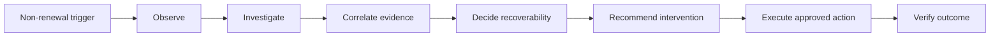
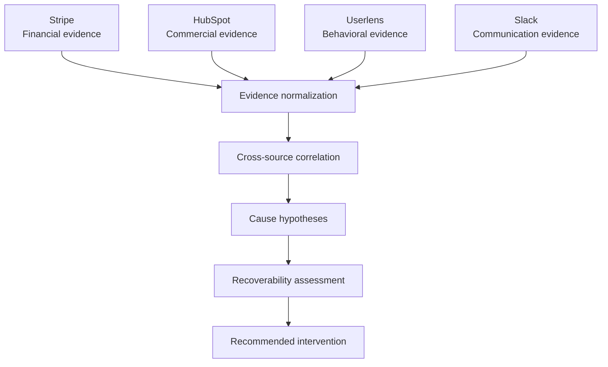
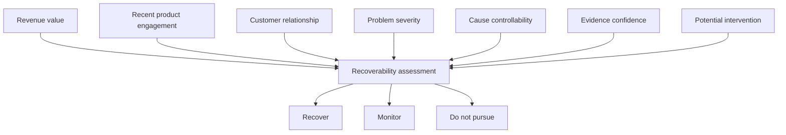
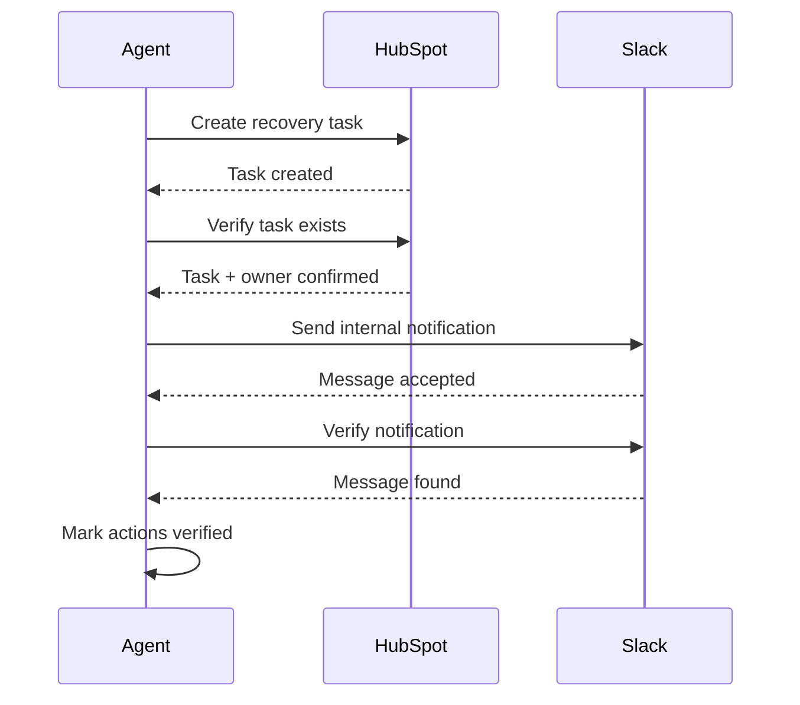
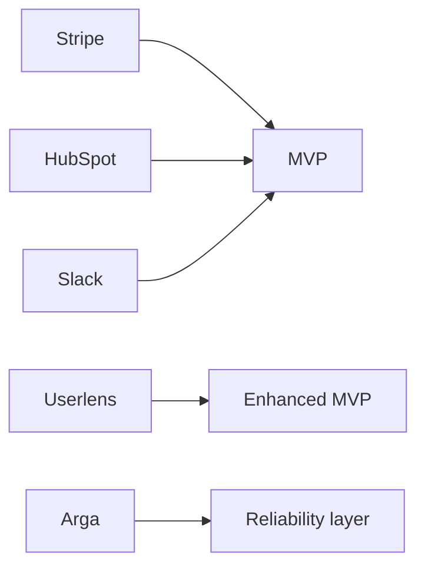
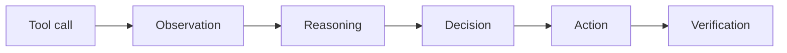
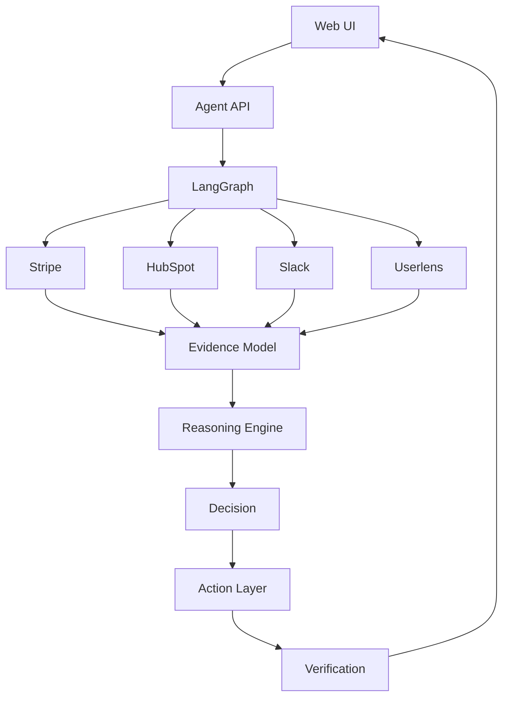
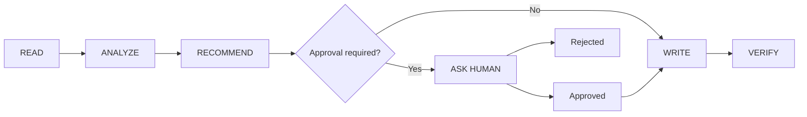
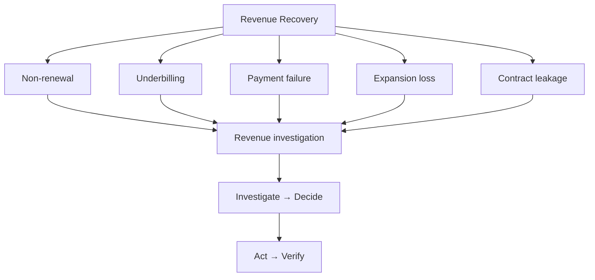

# Revive: AI-Powered Revenue Recovery Agent

**Working name:** Revive: AI-Powered Revenue Recovery Agent
**Category:** Multi-app AI Agent / Revenue Operations
**Initial wedge:** Non-renewal recovery for B2B SaaS
**Primary users:** Customer Success, RevOps, Finance, Account Managers
**MVP objective:** Investigate a lost renewal across multiple systems, establish an evidence-backed cause, determine recoverability, recommend the appropriate intervention, execute approved actions, and verify them.

---

## 1. Problem

When a B2B SaaS customer fails to renew, the company immediately knows **how much revenue was lost**, but often does not know **why it was lost or what should happen next**.

Relevant evidence is fragmented across billing, CRM, product behavior, support, and internal communication.

The agent turns:

> **Lost renewal → fragmented evidence → economic diagnosis → recovery decision → controlled action → verification**

into one workflow.

---

## 2. Product Thesis

> **Revenue Recovery Agent investigates economically significant revenue loss across business systems and determines the most appropriate recovery action based on evidence, rather than simply predicting churn or generating outreach.**

### We are not building

> “AI predicts which customers will churn.”

### We are building

> “A customer didn't renew. Tell me what actually happened, whether we should try to recover them, and what we should do.”

---

## 3. MVP Goal

Given a non-renewed customer, the agent should:

1. Identify the revenue impact.
2. Retrieve relevant evidence from connected systems.
3. Correlate evidence across systems.
4. Determine the most likely reason for non-renewal.
5. Assess whether recovery is plausible.
6. Recommend an intervention.
7. Execute safe internal actions.
8. Request approval for external/high-impact actions.
9. Verify that executed actions actually occurred.

### Success criterion

A user should be able to go from:

> **“Acme Corp lost $36k ARR.”**

to:

> **“Here's why it happened, here's the evidence, here's whether we should pursue recovery, and here's what I've already done.”**

without manually searching four applications.

---

## 4. Target User

### Primary user

**Customer Success Manager / Account Manager**

They own the customer relationship but may not have direct access to all financial and product context.

### Secondary users

**RevOps / Finance**

They care about revenue at risk/lost, recovery opportunities, financial correctness, and auditability.

### User story

> As a CSM, when a valuable customer fails to renew, I want the system to investigate the account automatically so that I can understand why the renewal failed and take the right recovery action without manually searching multiple systems.

---

## 5. Core Workflow



The entire MVP revolves around:

**TRIGGER → OBSERVE → INVESTIGATE → CORRELATE → DECIDE → ACT → VERIFY**

---

## 6. Trigger

For the hackathon, the user selects:

> **Investigate lost renewal**

and chooses a customer.

Example:

```text
Customer: Acme Corp
Account ID: ACME-001
Renewal: Lost
ARR: $36,000
Renewal date: September 10, 2026
```

A sophisticated event-streaming system is not required for the MVP.

---

## 7. Evidence Collection

### Stripe: Financial reality

Retrieve:

- customer
- subscription
- subscription status
- renewal/payment state
- invoices
- payment failures
- ARR/revenue impact

Example:

> Subscription ended on Sept 10. No payment failure detected. Estimated lost recurring revenue: $36,000 ARR.

### HubSpot: Commercial/account context

Retrieve:

- company
- contacts
- deal
- deal stage
- renewal status
- account owner
- relevant properties/notes
- previous activity

Example:

> Enterprise account owned by Sarah. Renewal opportunity marked closed-lost with no explicit loss reason.

### Userlens: Product behavior

Retrieve relevant customer/product signals such as:

- usage trend
- adoption
- feature usage
- engagement changes
- behavioral signals

Example:

> Weekly product activity declined 67% during the final 45 days before renewal. Feature X was never adopted.

Userlens should be treated as an **evidence source**, not recreated as a customer-success platform.

### Slack: Internal context

Search relevant conversations for:

- customer complaints
- implementation issues
- pricing concerns
- stakeholder changes
- CSM observations
- renewal discussions

Example:

> CSM noted repeated onboarding problems following the customer's migration.

---

## 8. Investigation Engine

The agent should not simply dump four API responses into an LLM. It should construct an evidence model.



---

## 9. Cause Taxonomy

### A. Product-value failure

Signals:

- declining usage
- poor feature adoption
- onboarding problems
- unresolved product friction

### B. Payment / billing issue

Signals:

- failed payment
- outstanding invoice
- payment-method issue
- billing failure

### C. Pricing / commercial objection

Signals:

- healthy usage
- pricing complaints
- negotiation activity
- discount requests
- competitor references

### D. Organizational change

Signals:

- champion departure
- restructuring
- budget freeze
- acquisition
- team reduction

### E. Product / service dissatisfaction

Signals:

- support tickets
- negative feedback
- repeated incidents
- unresolved issues

### F. Insufficient evidence

The system cannot confidently determine the reason.

The agent must be allowed to say:

> **Insufficient evidence. Do not initiate aggressive recovery.**

---

## 10. Evidence-Based Reasoning

Every diagnosis should contain:

- **Finding**: what happened
- **Evidence**: which systems support it
- **Confidence**: strength of evidence
- **Contradictions**: evidence pointing elsewhere
- **Conclusion**: most likely cause

Example:

```text
PRIMARY CAUSE
Product-value realization failure

CONFIDENCE
91%

SUPPORTING EVIDENCE

Userlens
• Usage declined 67%
• Feature X never adopted

Slack
• CSM reported onboarding friction
• Issue persisted for ~6 weeks

Stripe
• No payment failure

HubSpot
• Customer remained active until renewal
• Renewal marked closed-lost

CONTRADICTING EVIDENCE
None significant

CONCLUSION
The evidence strongly suggests the customer did not renew
because they failed to realize sufficient product value,
rather than because of a payment problem.
```

---

## 11. Recoverability Decision

Diagnosis alone is not enough.

The agent must answer:

> **Should we actually try to recover this account?**

Possible states:

- **RECOVER**
- **RECOVER: PAYMENT**
- **RECOVER: COMMERCIAL**
- **RECOVER: PRODUCT**
- **MONITOR**
- **DO NOT PURSUE**

### Recoverability factors



Important principle:

> **Revenue recovery is not synonymous with revenue chasing.**

---

## 12. Intervention Selection

| Diagnosis             | Recommended intervention           |
| --------------------- | ---------------------------------- |
| Product-value failure | CSM recovery + targeted onboarding |
| Payment issue         | Billing/payment follow-up          |
| Pricing               | Commercial review                  |
| Organizational change | Identify new stakeholder/champion  |
| Support/product issue | Resolve blockers first             |
| Insufficient evidence | Human investigation                |
| Poor fit              | Do not pursue                      |

The agent should explain why it selected the intervention.

---

## 13. Action Layer

Actions are separated by risk.

### Automatic actions

Safe internal operations:

- Create HubSpot recovery task
- Update CRM recovery status
- Notify account owner in Slack
- Generate recovery plan
- Record investigation summary

### Approval-required actions

Anything externally consequential:

- Send customer email
- Offer discount
- Modify subscription
- Change pricing
- Initiate financial action

The agent should produce a **proposed action** rather than silently executing high-impact actions.

---

## 14. Human Approval

Example:

```text
Recommended Action

Create a recovery task for Sarah and send the following
customer outreach:

"Hi John, ..."

Risk:
External communication

[Approve] [Edit] [Reject]
```

This provides a clear human-in-the-loop safety model.

---

## 15. Verification

After executing an action, the agent verifies the resulting state.



Important principle:

> **The agent doesn't consider an action complete merely because its tool call returned successfully.**

---

## 16. MVP Integrations

### Required

**Stripe**

- financial source of truth

**HubSpot**

- customer/account source of truth

**Slack**

- internal context + action surface

### Optional / differentiator

**Userlens**

- product behavior evidence

### Reliability / validation

**Arga Labs**

- validation of critical tool interactions/scenarios

### Integration priority



Userlens integration must not become a single point of failure for the demo.

---

## 17. Demo Dataset

The demo should contain several deterministic scenarios.

### Scenario 1: Product-value failure

```text
Acme Corp
ARR: $36k
Usage: ↓67%
Payment: healthy
Support: onboarding problems
Slack: CSM confirms frustration

Expected:
RECOVER
Reason: product-value failure
Action: onboarding intervention
```

### Scenario 2: Payment problem

```text
Beta Inc
ARR: $18k
Usage: healthy
Payment: failed
CRM: customer wants to continue
Slack: no product complaints

Expected:
RECOVER
Reason: payment failure
Action: billing follow-up
```

### Scenario 3: Pricing problem

```text
Gamma Ltd
ARR: $72k
Usage: healthy
Payment: healthy
Slack: repeated pricing objection
HubSpot: discount negotiation

Expected:
RECOVER: COMMERCIAL
Reason: pricing/value perception
Action: commercial review
```

### Scenario 4: Do not pursue

```text
Delta Corp
ARR: $8k
Usage: near zero
Support: minimal
Slack: customer moved to competitor
CRM: no active champion

Expected:
DO NOT PURSUE
```

### Scenario 5: Insufficient evidence

```text
Epsilon
ARR: $25k
Mixed signals
No meaningful Slack context
No clear CRM reason

Expected:
MONITOR / INSUFFICIENT EVIDENCE
```

These scenarios prove the agent is not simply following:

> “Customer didn't renew → send recovery email.”

---

## 18. UI

The product does not need a huge dashboard.

The primary interface should be an **investigation workspace**.

### Header

```text
Acme Corp
$36,000 ARR
Renewal Lost
```

### Investigation timeline

```text
16:42  Stripe     Subscription ended
16:42  HubSpot    Renewal marked closed-lost
16:43  Userlens   Usage decline detected
16:43  Slack      CSM context found
16:44  Agent      Evidence correlated
16:44  Agent      Recovery decision generated
```

### Main sections

1. Financial Impact
2. Evidence
3. Root Cause
4. Recoverability
5. Recommended Action
6. Actions Taken
7. Verification

The evidence chain should be the strongest visual element.

---

## 19. Non-Goals

For the hackathon MVP:

- No predictive churn model.
- No full customer-health platform.
- No generic CRM replacement.
- No autonomous pricing negotiation.
- No automatic discounts.
- No autonomous financial transactions.
- No complex billing reconciliation engine.
- No massive analytics dashboard.
- No real-time event infrastructure.
- No support for every CRM/payment provider.

These exclusions protect the six-hour build scope.

---

## 20. Reliability Requirements

Reliability is a first-class feature.

### Evidence grounding

Every major conclusion should identify its source.

### Unsupported claims

If a source does not contain evidence, the agent must not invent it.

### Conflicting evidence

Example:

```text
Userlens: healthy usage
Slack: CSM reports dissatisfaction
```

The agent should surface the contradiction.

### Missing data

```text
Userlens unavailable

→ diagnosis confidence reduced
→ do not pretend product behavior is known
```

### Action verification

Every mutation should have a verification step where possible.

### Investigation trace



---

## 21. Evaluation

Evaluation must exist before implementation.

For each scenario, the expected answer is known.

### Evaluation dimensions

**1. Cause accuracy**
Did the agent identify the intended primary cause?

**2. Evidence grounding**
Did it cite the correct sources?

**3. Recoverability accuracy**
Did it make the correct recover/don't-pursue decision?

**4. Intervention accuracy**
Did it choose the appropriate action?

**5. Action correctness**
Did it modify the correct system?

**6. Verification**
Did it correctly verify the resulting state?

**7. Safety**
Did it avoid unauthorized external/financial actions?

### Evaluation matrix

| Scenario        | Cause               | Recovery     | Action              |
| --------------- | ------------------- | ------------ | ------------------- |
| Product failure | Product value       | Recover      | Onboarding          |
| Payment         | Billing             | Recover      | Payment follow-up   |
| Pricing         | Commercial          | Recover      | Commercial review   |
| Competitor      | Poor recoverability | Don't pursue | None                |
| Unknown         | Unknown             | Monitor      | Human investigation |

---

## 22. Technical Direction

Keep the architecture small.



Do **not** build seven microservices, Kafka, ClickHouse, or a complex event bus for this MVP.

This is an agent workflow problem, not a distributed-systems problem.

---

## 23. Agent State

Conceptual LangGraph state:

```text
InvestigationState

customer
financial_evidence
crm_evidence
behavioral_evidence
communication_evidence

findings
cause_hypotheses
confidence
contradictions

recoverability
recommended_intervention

proposed_actions
approved_actions
executed_actions
verification_results
```

This creates a deterministic state machine around the LLM rather than letting the LLM freestyle the entire application.

---

## 24. Guardrails

The agent should follow:



Financial and external mutations should never happen merely because the model decided they were appropriate.

---

## 25. Hackathon Success Metrics

### Technical execution

- 3+ real application integrations
- reliable multi-step workflow
- working mutations
- verification

### Reliability

- deterministic test scenarios
- evidence-grounded reasoning
- failure handling
- action verification

### Usefulness

The demo should answer:

> **“We just lost $36k. What happened and what should we do?”**

### Originality

Differentiation comes from:

> **Revenue event → cross-system investigation → recoverability decision**

rather than generic customer health/churn scoring.

### Demo clarity

The value proposition should be understandable within the first 20 seconds.

---

## 26. MVP Definition of Done

The MVP is complete when we can demonstrate:

> Select Acme Corp → agent investigates Stripe + HubSpot + Slack (+ Userlens if available) → constructs evidence → identifies cause → determines recoverability → proposes intervention → creates an internal recovery action → asks approval for external communication → executes it → verifies the action → presents the complete investigation trace.

The system should run at least **3 materially different scenarios** without changing application code.

---

## 27. Product North Star

The eventual product can expand from **non-renewal recovery** to broader revenue recovery:



None of these expansion areas belong in the hackathon MVP.

---

# 28. One-Sentence PRD

> **Revenue Recovery Agent investigates why a valuable B2B SaaS customer failed to renew by correlating billing, CRM, product behavior and internal communication, determines whether recovery is rational, and executes a controlled, verifiable recovery workflow.**
