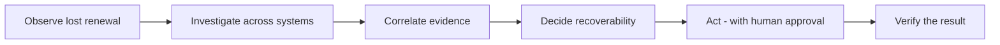
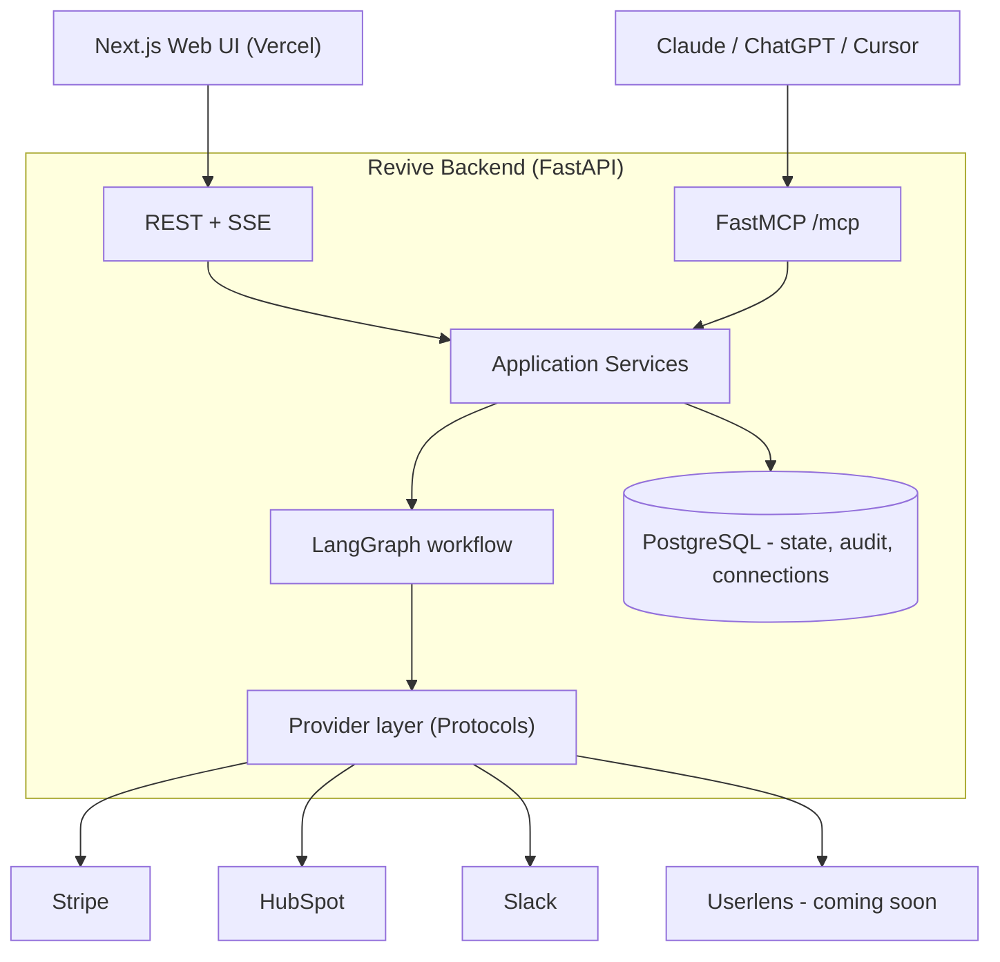
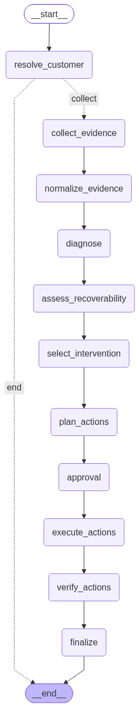

# Revive - AI-Powered Revenue Recovery Agent

> A B2B SaaS customer didn't renew. You instantly know **how much** you lost - but not **why**, whether recovery is even rational, or **what to do next**. Revive investigates the lost renewal
> across Stripe, HubSpot, Slack and product usage, builds an **evidence-backed** diagnosis, decides whether recovery is worth it, recommends and **executes** the right action with a
> human-in-the-loop gate, and **verifies** the result.

**Live demo:** Frontend → https://revive-ai-revops.vercel.app · Backend API → https://revive-api.log0.in
· MCP server → `https://revive-api.log0.in/mcp`

## 📺 Two-minute demo

<!-- Replace VIDEO_ID with the unlisted YouTube id. The thumbnail below previews on GitHub and
     links to the video (GitHub sanitizes <iframe>, so a linked thumbnail is the way to embed). -->

▶️ **Watch the 2-minute demo:** [www.youtube.com/watch?v=_r6Dh5byE9c](https://www.youtube.com/watch?v=_r6Dh5byE9c)

---

## 1. Overview

Revive turns one messy workflow:

> **Lost renewal → fragmented evidence → economic diagnosis → recovery decision → controlled action → verification**

into a single, reliable agent. It is **not** a churn-prediction score and **not** an outreach
spam-bot. It answers the question a Customer Success / RevOps team actually asks:

> *"We just lost $36k from Acme. What happened, should we chase it, and what have you already done?"*

The core loop:



What makes it different:

- **Evidence-grounded** - every conclusion cites the specific evidence (Stripe/HubSpot/Slack/Userlens IDs) that supports and contradicts it. If evidence is missing, it returns `INSUFFICIENT_EVIDENCE` instead of inventing a cause.
- **Decides recoverability, not just cause** - it will say **DO NOT PURSUE** for a lost-cause account, so you don't waste effort.
- **Human-in-the-loop** - anything customer-facing or financial pauses for approval; the model never decides on its own that an external action is safe.
- **Verifies its own actions** - it re-reads the system after each write; a tool call returning `200` is not "done" until the state is confirmed.
- **Two front doors, one brain** - the same application services power both the web app (for humans) and an **MCP server** (so Claude / ChatGPT / Cursor can run the whole recovery workflow as a tool).

## 2. Architecture



- **LangGraph** owns orchestration as a controlled state machine (not a free-form ReAct loop): `resolve → collect evidence → normalize → diagnose → assess recoverability → select intervention → plan → approve → execute → verify`.
- **Provider Protocols** isolate every vendor. Two implementations sit behind them: a deterministic **seed** provider (fixtures, for demo + evaluation) and a **live** provider that talks to real Stripe / HubSpot / Slack.
- **Reasoning is deterministic-first**: a heuristic derives the diagnosis from structured evidence; the LLM enriches it. If the LLM is unavailable, the heuristic stands - the workflow always completes.
- **Durable + resumable**: full graph state is persisted in Postgres (LangGraph checkpointer), so an investigation paused for approval survives restarts and resumes exactly where it left off.

### The actual LangGraph workflow

Rendered directly from the compiled graph in [`backend/app/agent/graph.py`](backend/app/agent/graph.py):

<p align="center">
  
</p>

`resolve_customer` short-circuits to the end if the customer cannot be resolved; otherwise the full
`investigate → normalize → diagnose → assess recoverability → select intervention → plan → approve → execute → verify → finalize` pipeline runs, pausing at `approval` for any external or financial action.

**Stack:** Python 3.13 · FastAPI · FastMCP · LangGraph · LangChain + HuggingFace · Pydantic v2 ·PostgreSQL (SQLAlchemy 2 / asyncpg / psycopg) · Fernet-encrypted credentials · Next.js 16 ·
TypeScript · Tailwind CSS · Docker · Cloudflare Tunnel.

## 3. External apps used

| App                   | Role in Revive                                                                                                                                          | Integration                                                                                                               |
| --------------------- | ------------------------------------------------------------------------------------------------------------------------------------------------------- | ------------------------------------------------------------------------------------------------------------------------- |
| **Stripe**      | Financial truth - subscription status, payment failures, ARR / revenue impact                                                                           | Live: raw Stripe API + Stripe MCP; the "book of business" of lost/at-risk renewals is read live from Stripe subscriptions |
| **HubSpot**     | Commercial context - company, deal, renewal status, owner, notes; recovery tasks                                                                        | Private-App token (raw API) / remote MCP (OAuth)                                                                          |
| **Slack**       | Internal context - CSM discussions, complaints; account-owner notifications                                                                             | Bot token (Web API)                                                                                                       |
| **Userlens**    | Product-behavior evidence (usage, adoption)                                                                                                             | **Coming soon** (marked in the UI) - the evidence slot and provider are built                                       |
| **HuggingFace** | LLM reasoning for the diagnosis / recoverability nodes                                                                                                  | `langchain-huggingface` (model configurable; heuristic fallback)                                                        |
| **LangSmith**   | Agent tracing + run inspection                                                                                                                          | `LANGCHAIN_TRACING_V2`, project `revive`                                                                              |
| **Arga Labs**   | **Reliability testing** - stateful "twins" of Stripe/Slack seeded with scenarios, used to validate live tool interactions without production data | Twin runs over MCP; verified end-to-end against a seeded Slack twin                                                       |
| **Cloudflare**  | Public HTTPS for the shared backend (named tunnel`revive-api.log0.in`)                                                                                | `cloudflared` credentials-file tunnel                                                                                   |

Revive is both an **MCP client** (consuming Stripe/HubSpot/Slack/Arga MCP servers) and an **MCP
server** (exposing its own business capabilities).

### Revive MCP tools (add `https://revive-api.log0.in/mcp` to any MCP client)

```
investigate_customer(customer)                       -> full investigation
get_investigation_result(investigation_id)           -> full investigation
list_recent_investigations()                         -> summaries
resume_recovery(investigation_id, approved, edits?)  -> approve/reject a paused investigation
```

## 4. How to run it

Two ways: everything in Docker (recommended), or backend + frontend locally.

### Prerequisites

- [Docker](https://www.docker.com/) + Docker Compose
- [uv](https://docs.astral.sh/uv/) (Python 3.13)
- Node.js 20+ (for the frontend)

### A. Full stack in Docker (Postgres + backend + public tunnel)

```bash
# 1. Backend env
cp backend/.env.example backend/.env
#    set REVIVE_SECRET_KEY (Fernet key), HF_TOKEN (optional; heuristic works without it):
#    python -c "from cryptography.fernet import Fernet; print(Fernet.generate_key().decode())"

# 2. Bring up Postgres + backend (+ Cloudflare quick tunnel)
docker compose up -d --build
docker compose logs -f cloudflared   # prints the public https URL

# health
curl http://127.0.0.1:8000/api/v1/health
```

### B. Local dev

```bash
# Postgres
docker compose up -d postgres          # host port 5433

# Backend
cd backend
uv sync --extra dev --extra db
uv run python -m scripts.serve         # http://127.0.0.1:8000  (Swagger at /docs, MCP at /mcp)

# Frontend (new terminal)
cd frontend
cp .env.example .env.local             # NEXT_PUBLIC_API_BASE -> your backend URL
npm install
npm run dev                            # http://localhost:3000
```

> **Windows note:** use `scripts.serve` (not `uvicorn` directly) - it selects the SelectorEventLoop
> that psycopg's async driver needs.

### Data source: `seed` vs `live`

- `REVIVE_DATA_SOURCE=seed` (default) - five deterministic scenarios; safe, instant, no credentials. This is the demo default.
- `REVIVE_DATA_SOURCE=live` - reads the user's stored Stripe/HubSpot/Slack connections. Users connect their own tools on the **Integrations** page; tokens are **encrypted at rest (Fernet)** and never returned to the browser.

### Try it

- Web: open the frontend, pick a lost renewal (e.g. **Northwind Robotics**), watch the live investigation, approve the outreach, see actions verified.
- API: `curl -X POST $BASE/api/v1/investigations -H 'Content-Type: application/json' -H 'X-User-Id: demo-user' -d '{"customer":"Northwind Robotics"}'`
- MCP: add `https://revive-api.log0.in/mcp` to Claude/Cursor and call `investigate_customer`.

## 5. How we tested reliability

Reliability is treated as a first-class feature, not an afterthought.

**1. Deterministic evaluation harness.** Five scenarios (product-value failure, payment failure,
pricing objection, poor fit → do-not-pursue, insufficient evidence) have known expected outcomes.
The harness runs the *real* workflow end-to-end and scores eight dimensions:

```bash
cd backend && uv run python -m scripts.run_eval   # writes eval_report.json
```

| Metric                                                        | Result |
| ------------------------------------------------------------- | ------ |
| Cause accuracy                                                | 100%   |
| Recoverability accuracy                                       | 100%   |
| Intervention accuracy                                         | 100%   |
| Revenue accuracy                                              | 100%   |
| Evidence attribution                                          | 100%   |
| Verification success rate                                     | 100%   |
| Approval compliance (no external action ran without approval) | 100%   |
| False-action rate (actions on do-not-pursue)                  | 0%     |

**2. Evidence grounding.** Every cause/recoverability conclusion references the evidence IDs that support and contradict it. Missing a source (e.g. no Slack data) yields `INSUFFICIENT_EVIDENCE`
rather than a fabricated cause - the eval asserts this.

**3. Action verification (ACT → VERIFY).** After each write the agent re-reads the target system and compares expected vs actual state; only then is an action `verified`. Writes are idempotent
(keyed by action id) so retries/resumes never double-execute.

**4. Human-in-the-loop, deterministic policy.** External/financial actions are classified by a **deterministic** policy (never the LLM) and pause the graph via a LangGraph `interrupt()`. State
is persisted, so approval/rejection is durable across processes and restarts. Reject → the customer message is never sent.

**5. Real tool validation with Arga Labs.** We validated the live provider layer against **Arga Labs twins** - stateful sandboxes of Slack/Stripe seeded with scenario data - pulling real evidence
over MCP without touching production systems.

**6. Automated tests + tracing.** 22 backend tests cover the workflow, REST + SSE, MCP tools, persistence, connections (encryption round-trip), and the live-MCP provider path; the frontend is
type-checked and built in CI-style locally. LangSmith traces every agent run.

```bash
cd backend && uv run pytest -q      # 22 passed
cd frontend && npm run build        # type-check + build
```

## 6. Repository layout

```
Revive/
├── backend/            # FastAPI + FastMCP + LangGraph agent
│   ├── app/
│   │   ├── agent/          # LangGraph state, nodes, graph, LLM
│   │   ├── domain/         # models, services, policies
│   │   ├── integrations/   # provider Protocols, seed fixtures, MCP clients, Arga
│   │   ├── persistence/    # Postgres checkpointer, tables, repositories
│   │   ├── evaluation/     # reliability harness + metrics
│   │   ├── api/ + mcp/     # REST routes + Revive MCP server
│   │   └── main.py
│   ├── scripts/            # serve, run_slice, run_eval, run_live, arga_twin
│   └── tests/
├── frontend/           # Next.js 16 investigation workspace (Vercel)
├── docs/               # API contract, deploy, Arga integration
├── docker-compose.yml  # Postgres + backend + Cloudflare tunnel
├── PRD.md / HLD.md / LLD.md
└── README.md
```

More detail: [`docs/API.md`](docs/API.md) (API contract), [`docs/DEPLOY.md`](docs/DEPLOY.md)
(deployment), [`docs/ARGA-integration.md`](docs/ARGA-integration.md) (reliability twins).

## 7. Team

| Member          | Email                          | GitHub                                    |
| --------------- | ------------------------------ | ----------------------------------------- |
| Ashmit Gupta    | ashmitgupta.official@gmail.com | [@ashmitjsg](https://github.com/ashmitjsg) |
| Akshun Kuthiala | akshunkuthiala2002@gmail.com   | [@Akshun-01](https://github.com/Akshun-01) |

## 8. Access for judges

- **Repository:** this repo (public).
- **Live frontend:** https://revive-ai-revops.vercel.app
- **Live backend + MCP:** https://revive-api.log0.in · `https://revive-api.log0.in/mcp`
- **Demo video:** https://youtu.be/VIDEO_ID

_Built for the Multi-App AI Agent Hackathon._
